# Example 1. Enabling MTLS on Spring Boot (Java) REST service

This is a simple REST microservice (Maven Project) based on Spring Boot 2.4.2 and Java 11. 

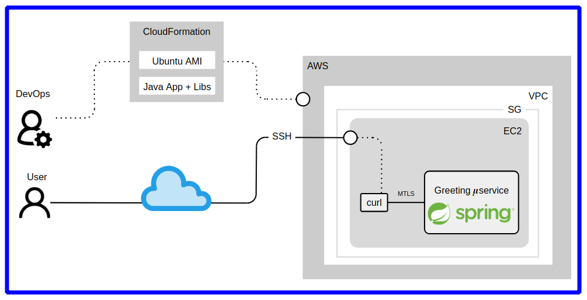

## Tools used

* OpenJDK 11 and Spring Boot to create the microservice.
* Java KeyTool to generate key-pairs, private and public keys, public key certificates and import, export and encode key material.
* OpenSSL to convert certificates to PEM/DER formats.
* Maven to build and run the application.


## Steps

### 1. Saying greeting (without encryption in transit)

#### 1. Initial configuration of REST service.

Check the initial confiration file. That file is locate here `src/main/resources/application.yml` and you should have this configuration:  

```yaml
$ cat src/main/resources/application.yml

server:
  port: 9090
``` 

#### 2. Clean and build the project for the first time.  

> **Important:**   
>   
> Make sure the owner of all files and directories under `workdir` is ``$USER`, if the owner is ``root` the labs will not work.
> You can set up a owner using this command: `sudo chown -R $USER $HOME/workdir/`

```sh
$ cd mtls-apps-examples/1-greeting-java 
$ mvn clean
$ mvn spring-boot:run
``` 

#### 3. Calling the REST service.  

In other terminal, execute this:
```sh
$ curl -i http://localhost:9090/greeting
```

#### 4. It should give you the following response:  

```sh
HTTP/1.1 200 
Content-Type: application/json
Transfer-Encoding: chunked
Date: Tue, 16 Feb 2021 13:41:15 GMT

{"id":1,"content":"Hello, World!"}
```

#### 5. Close the running REST service.

Just type `Ctrl + C`.   

### 2. Enabling HTTP over TLS (One-way TLS)

#### 1. Enable One-way TLS.   

Only update `src/main/resources/application.yml` with the next configuration:  
```yaml
$ nano src/main/resources/application.yml

server:
  port: 9443
  ssl:
    enabled: true
``` 

#### 2. Restart the REST service so that it can apply the changes.   

```sh
$ mvn clean spring-boot:run
``` 

You will get the following error:
```sh
Caused by: java.lang.IllegalArgumentException: Resource location must not be null
        at org.springframework.util.Assert.notNull(Assert.java:201) ~[spring-core-5.3.3.jar:5.3.3]
        at org.springframework.util.ResourceUtils.getURL(ResourceUtils.java:130) ~[spring-core-5.3.3.jar:5.3.3]
        at org.springframework.boot.web.embedded.tomcat.SslConnectorCustomizer.configureSslKeyStore(SslConnectorCustomizer.java:129) ~[spring-boot-2.4.2.jar:2.4.2]
        ... 16 common frames omitted
```
> **Important:**   
>   
> We are getting this message because the REST service (server) requires a keystore with the certificate of the REST service (server) to ensure that there is a secure connection with the outside world.  
>  
> To solve this, we are going to create a keystore with a public and private key for the REST service (server). The public key will be shared with users/clients so that they can encrypt the communication.  
> The communication between both parties (user and server) can be decrypted with the private key of the REST service (server).  
> The private key of the REST service (server) never must be shared and must be keep it secret, symmetrically encrypted or in a vault (i.e. PKCS#7, HSM, Hashicorp Vault).

#### 3. Generate the server certificate.   

Any Java application use [keystore](https://en.wikipedia.org/wiki/Java_KeyStore) file as repository of public-key certificates and asymmetric private keys. Then, to create a keystore with a public and private key, execute the following command in your terminal:
```sh
$ keytool -v \
        -genkeypair \
        -dname "CN=Server (MTLS for Java Microservice),OU=DevOps Playground,O=ECS,C=UK" \
        -keystore src/main/resources/server_identity.jks \
        -storepass secret \
        -keypass secret \
        -keyalg RSA \
        -keysize 2048 \
        -alias server \
        -validity 3650 \
        -deststoretype PKCS12 \
        -ext KeyUsage=digitalSignature,dataEncipherment,keyEncipherment,keyAgreement \
        -ext ExtendedKeyUsage=serverAuth,clientAuth \
        -ext SubjectAlternativeName:c=DNS:localhost,IP:127.0.0.1

Generating 2,048 bit RSA key pair and self-signed certificate (SHA256withRSA) with a validity of 3,650 days
        for: CN=MTLS for Java Microservice, OU=DevOps Playground, O=ECS, C=UK
[Storing src/main/resources/server_identity.jks]
```

Once generated the TLS certificate, you will need to update the REST service (server) `src/main/resources/application.yml` file with the location of the keystore and symmetric passwords required for keystore itself and for private key.  
```yaml
$ nano src/main/resources/application.yml

server:
  port: 9443
  ssl:
    enabled: true
    key-store: classpath:server_identity.jks
    key-password: secret
    key-store-password: secret
```

#### 4. Run the REST service and test the One-way TLS connection.   

```sh
$ mvn clean spring-boot:run
```

In other terminal execute this:
```sh
$ curl --insecure -v https://localhost:9443/greeting

## alternatively with '-k' option
$ curl -k https://localhost:9443/greeting

{"id":1,"content":"Hello, World!"}
```

Now, if we remove the `--insecure` or `-k` we will get this error:
```sh
$ curl https://localhost:9443/greeting

curl: (60) SSL certificate problem: unable to get local issuer certificate
More details here: https://curl.haxx.se/docs/sslcerts.html

curl failed to verify the legitimacy of the server and therefore could not
establish a secure connection to it. To learn more about this situation and
how to fix it, please visit the web page mentioned above.
```
> **Important:**   
>   
> That means `curl` (client) can not get validated the REST service's TLS certificate because the client don't have or don't trust the CA that issued the REST service certificate.

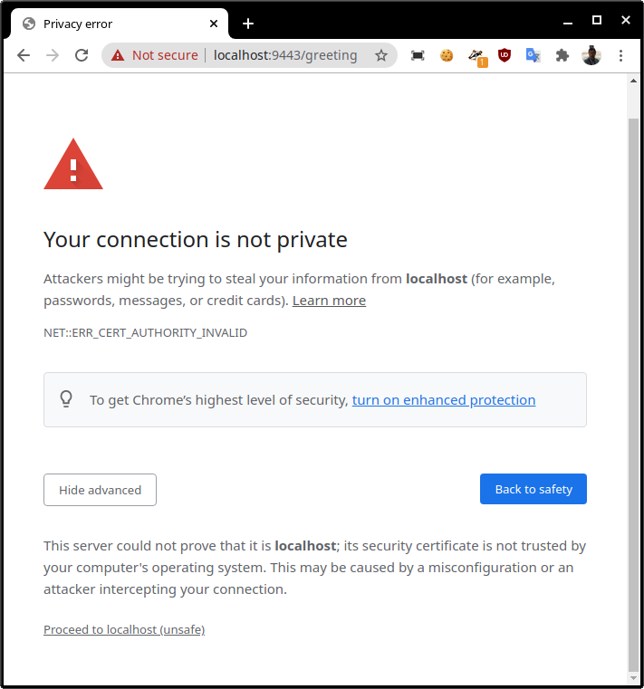

To avoid this error, you need to get the certificate(s) of the server and store it in trusted CA certificate store in your server and/or browser.  
You can get the server certificate with the following command. Execute it from `$HOME/workdir/mtls-apps-examples/1-greeting-java`:
```sh
$ keytool -v \
    -exportcert \
    -file src/main/resources/server.crt \
    -alias server \
    -keystore src/main/resources/server_identity.jks \
    -storepass secret \
    -rfc 

Certificate stored in file <src/main/resources/server.crt>
```

Now, install `src/main/resources/server.crt` in trusted CA certificate store that curl uses, once done, you will be able to call the REST service without problems.  
```sh
$ curl --cacert src/main/resources/server.crt \
       --capath /etc/ssl/certs/ \
        https://localhost:9443/greeting
```
Install CA certificates in the trusted CA certificate store and make available to curl requires compile curl from source code. The process is explained in below links:
* [curl website - SSL Certificate Verification](https://curl.se/docs/sslcerts.html)
* [Daniel Stenberg's blog - Get the CA Cert for curl](https://daniel.haxx.se/blog/2018/11/07/get-the-ca-cert-for-curl/)

Unfortunately curl still will show same error about `verify the legitimacy of the server` because, curl doesn't validate self-signed certificates, despite installing it in the CA certificate store. 
However, you would bypass this using Browser instead of curl.

#### 5. Testing the One-way TLS connection using Chrome Browser.   

Bypassing certificate validation is not a recommended option in many of the client libraries and applications. However, we can do it in our Browser, only for testing purposes.  
We need to get access to our REST service from a fully qualified domain name (fqdn) and if you are lucky of using a remote workstation provided by **DevOps Playground Team**, then you that is easy.  
First of all, you need to identify what is your assigned `Panda`, with that you can open this url (`https://<panda-type>.devopsplayground.org:9443/greeting`) in your browser.  
In my case the REST service is available in this URL `https://funny-panda.devopsplayground.org:9443/greeting`. See below images:

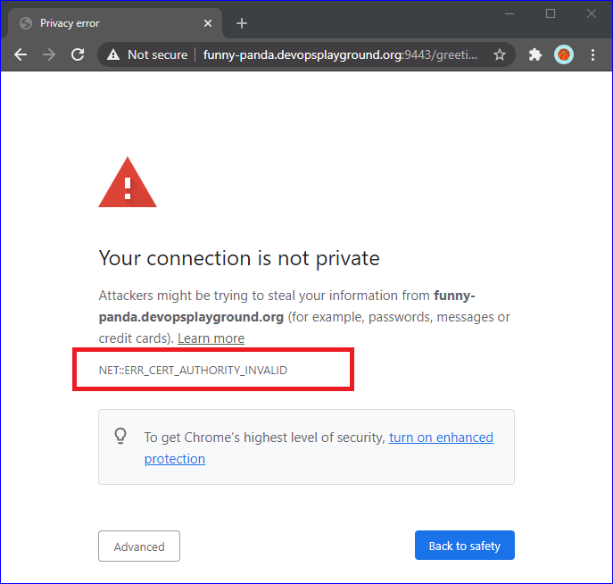

You will see `NET::ERR_CERT_AUTHORITY_INVALID` message, that means you have to install and trust on the CA certificate, and since our server certificate is a self-signed certificate, only the server certificate is needed. You can download it from your remote workstation or copy it directly from browser. See next image.

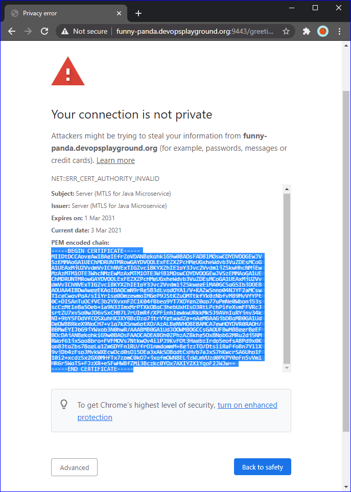

Once downloaded the server certificate, install it in your browser. See next images to how to install the certificate in Chrome.

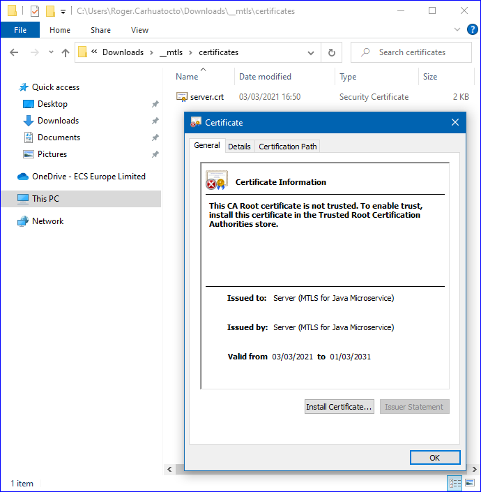
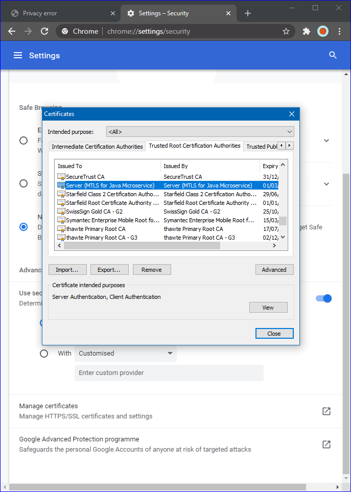

Once installed as trusted CA in your browser, reload your browser and you will see the `NET::ERR_CERT_COMMON_NAME_INVALID` message. It means you have trusted on a server certificate that doesn't match with the REST service's Domain Name. In other words, the server certificate has been generated for a REST service hosted on `localhost` and `127.0.0.1` and not on `funny-panda.devopsplayground.org`.   

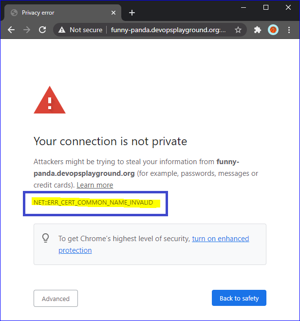

At this point you are able to accept the risk and proceed to use the REST service. But, if you don't want it would generate a new server certificate with a proper FQDN. Only follow below steps: 

```sh
$ rm -rf src/main/resources/server*
```

Now, generate a new server certificate (and private key) using your assigned `Panda` (FQDN). Note this parameter `SubjectAlternativeName:c=DNS:funny-panda.devopsplayground.org,DNS:localhost,IP:127.0.0.1`:
```sh
$ keytool -v \
        -genkeypair \
        -dname "CN=Server Funny-Panda,OU=DevOps Playground,O=ECS,C=UK" \
        -keystore src/main/resources/server_identity.jks \
        -storepass secret \
        -keypass secret \
        -keyalg RSA \
        -keysize 2048 \
        -alias server \
        -validity 3650 \
        -deststoretype PKCS12 \
        -ext KeyUsage=digitalSignature,dataEncipherment,keyEncipherment,keyAgreement \
        -ext ExtendedKeyUsage=serverAuth,clientAuth \
        -ext SubjectAlternativeName:c=DNS:funny-panda.devopsplayground.org,DNS:localhost,IP:127.0.0.1
```

Get the new server certificate (`server_fqdn.crt`) to be downloaded or just copy the PEM format from your browser like you did above. 
```sh
$ keytool -v \
    -exportcert \
    -file src/main/resources/server_fqdn.crt \
    -alias server \
    -keystore src/main/resources/server_identity.jks \
    -storepass secret \
    -rfc 
```

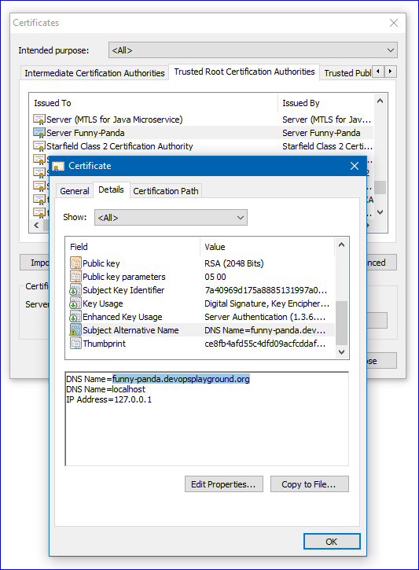

Once installed the new server certificate with the FQDN as a trusted CA certificate in your browser, reload the REST service `Ctrl + C` and `mvn clean spring-boot:run`, open a Chrome incognito window with the REST service URL and you will not see any error message anymore.

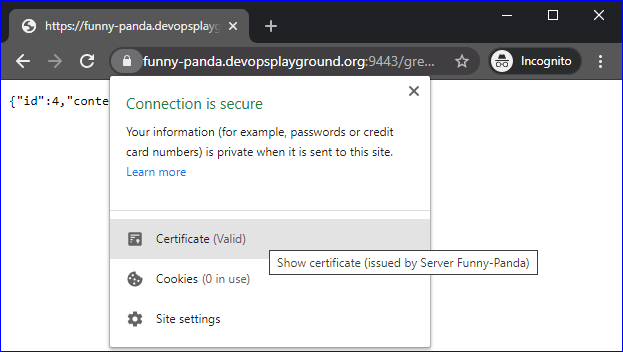


### 3. Enabling Mutual TLS Authentication (Two-way TLS)

The configuration of MTLS (Two-way TLS) in the server will require a new certificate for the authentication of the client. 
This configuration will force the client (curl, your browser or any proper HTTP client) to identify itself using a certificate, and in that way, the server (REST service) 
can also validate the identity of the client and whether or not it is a trusted one. 
You can get this by configuring the server (REST service) that you also want to validate the client with the property `client-auth` in the `src/main/resources/application.yml` file.   

1. Update following properties in the `src/main/resources/application.yml` file of the REST service (server):   

```yaml
server:
  port: 9443
  ssl:
    enabled: true
    key-store: classpath:server_identity.jks
    key-password: secret
    key-store-password: secret
    client-auth: need                             ## require client authn
``` 

2. Run your client to check REST service MTLS configuration.   

```sh
$ curl --cacert src/main/resources/server.crt https://localhost:9443/greeting

curl: (56) OpenSSL SSL_read: error:14094412:SSL routines:ssl3_read_bytes:sslv3 alert bad certificate, errno 0
```

Running the curl client will fail with the following error message: `error:14094412:SSL routines:ssl3_read_bytes:sslv3 alert bad certificate, errno 0`.   
This indicates that the certificate of the client is not valid because there is no certificate at all. So, let's create one with the following command:

```sh
$ keytool -v \
        -genkeypair \
        -dname "CN=Client (MTLS for Java Microservice),OU=DevOps Playground,O=ECS,C=UK" \
        -keystore src/main/resources/client_identity.jks \
        -storepass secret \
        -keypass secret \
        -keyalg RSA \
        -keysize 2048 \
        -alias client \
        -validity 3650 \
        -deststoretype PKCS12 \
        -ext KeyUsage=digitalSignature,dataEncipherment,keyEncipherment,keyAgreement \
        -ext ExtendedKeyUsage=serverAuth,clientAuth 
```

> The above command will not add the `SubjectAlternativeName` attribute to the client certificate (`-ext SubjectAlternativeName:c=DNS:<client-fqdn>,IP:<client-ip-address>`) because the client (curl or browser) will be executed in the same host where the REST service is running. But if you want to execute the client (curl or browser) from different host, you could set a `SubjectAlternativeName` attribute with a `fqdn`, `hostname` or `IP address` what the REST service (server) can resolve and validate without issues.   
> You can simulate this behaviour when running the client and server in the same host, only you have to add as client's hostname and server's hostname to the `/etc/hosts` file.

Once the `client_identity.jks` (private key and public key certificate) has been generated, we must tell the server about which root and intermediate certificates to trust. This is done creating a `truststore` containing all those trusted certificates. We can get the client certificate extracting it from previously generated `client_identity.jks`.

3. Extract the client certificate from `client_identity.jks`.  

```sh
$ keytool -v \
        -exportcert \
        -file src/main/resources/client.crt \
        -alias client \
        -keystore src/main/resources/client_identity.jks \
        -storepass secret \
        -rfc 
```

4. Create the server truststore with the client certificate.   

```sh
$ keytool -v \
        -importcert \
        -file src/main/resources/client.crt \
        -alias client \
        -keystore src/main/resources/server_truststore.jks \
        -storepass secret \
        -noprompt
```

5. Now update server `src/main/resources/application.yml` file to be aware of `server_truststore.jks`.   

```yaml
server:
  port: 9443
  ssl:
    enabled: true
    key-store: classpath:server_identity.jks
    key-password: secret
    key-store-password: secret
    client-auth: need                             ## require client authn
    trust-store: classpath:server_truststore.jks  ## trusted root and intermediate certs store
    trust-store-password: secret
``` 

6. Restart the server and check MTLS is enabled.   

Unfortunatelly `cURL` doesn't support `Java KeyStore` files containing keys. The `cURL` only sopport `PEM`, `DER` and `ENG` and all `*.crt` files are in format `PEM`. Then, we need to convert `client_identity.jks`, which contain the client's key-pair (public and private) to `PEM` format.

The below command only is necessary if the previous `Java KeyStore` file was created in `JKS` format. In our case all `Java KeyStore` files were create with the `-deststoretype PKCS12` flag, so that next command is not necessary.

```sh
$ keytool -importkeystore \
        -srckeystore src/main/resources/client_identity.jks \
        -destkeystore src/main/resources/client_identity.p12 \
        -srcstoretype JKS \
        -deststoretype PKCS12 \
        -srcstorepass secret \
        -deststorepass secret \
        -srcalias client \
        -destalias client \
        -srckeypass secret \
        -destkeypass secret \
        -noprompt
```

Generate the `PEM` file that holds only the private key.

```sh
$ openssl pkcs12 \
          -in src/main/resources/client_identity.jks \
          -out src/main/resources/client_identity.pem \
          -passin pass:secret \
          -passout pass:secret \
          -nocerts
```

7. Finally, you are able to call to the REST service to test MTLS.   

```sh
$ curl --cacert src/main/resources/server.crt \
       --key src/main/resources/client_identity.pem \
       --cert src/main/resources/client.crt \
       https://localhost:9443/greeting

Enter PEM pass phrase:

{"id":3,"content":"Hello, World!"}
```

To take advantage of `curl --cert <certificate[:password]>` and avoid prompt for the private key's passphrase, we could generate a `PKCS12` file in `PEM` format with a passphrase containing the certificate and its corresponding private key.
We can get it using the next command:

```sh
$ openssl pkcs12 \
          -in src/main/resources/client_identity.jks \
          -out src/main/resources/client.p12.pem \
          -passin pass:secret \
          -passout pass:secret
```

Finally, execute curl again passing the passphrase using this flag `--cert <certificate[:password]>`:   
```sh
$ curl --cacert src/main/resources/server.crt \
       --cert src/main/resources/client.p12.pem:secret \
       https://localhost:9443/greeting

{"id":5,"content":"Hello, World!"}
```

8. MTLS from the browser.   

By default, Chrome and Firefox can not stablish TLS communication with servers using self-signed certificates, however Chrome does have a flag for allowing untrusted certificates from the localhost origin. This option is available from the `chrome://flags/#allow-insecure-localhost` page. Once enabled, install in your browser the client PKCS12 file (`src/main/resources/client_identity.jks`) which contains the public-key certificate and private key protected by the `secret`, passphrase, and open the REST service `https://localhost:9443/greeting`. The browser will prompt to select the client identity to use during Mutual TLS authentication.

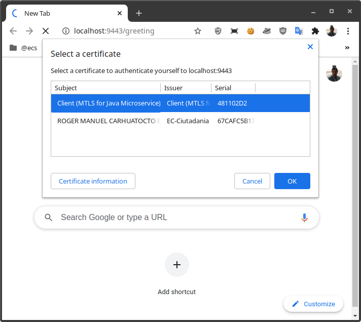  
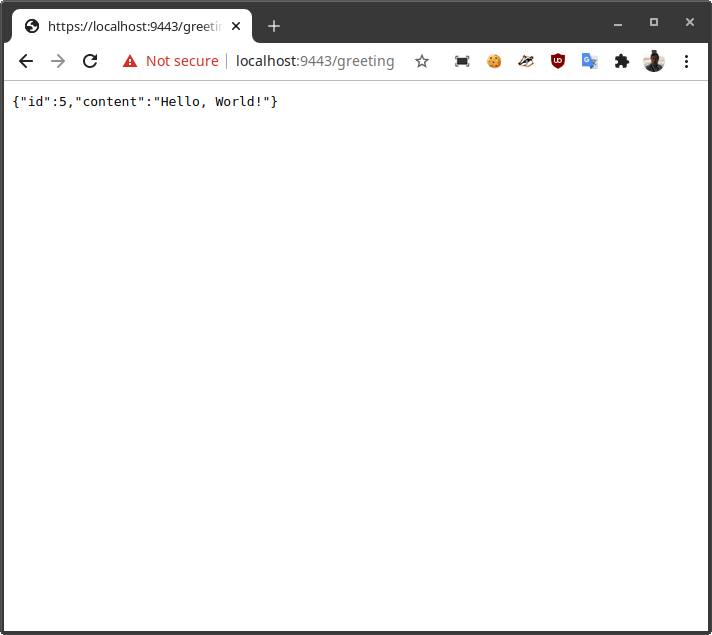


## References

* https://spring.io/guides/gs/rest-service/