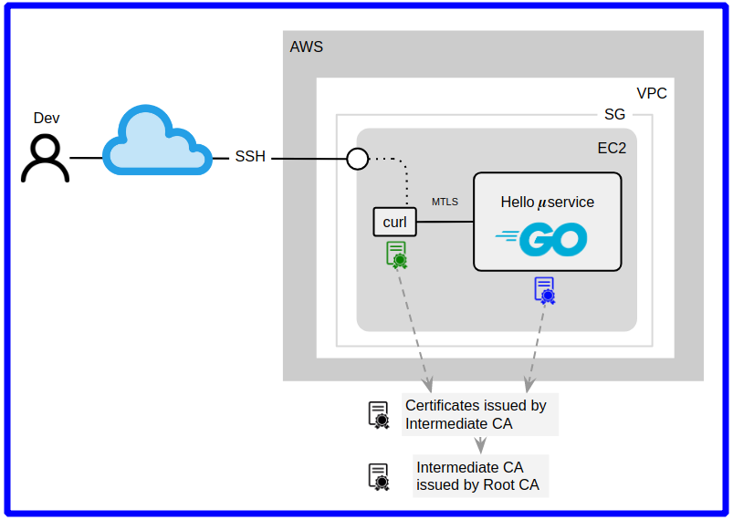

# Example 2. Enabling MTLS on Go-based Microservices

This is a simple REST microservice based on Go 1.13.8 create to demonstrate how to configure Mutual TLS authentication (Two-way TLS) using TLS certificates issued for Intermediate Certificate Authority.



This example is based on [Nick Jackson's MTLS Example GitHub repo](https://github.com/nicholasjackson/mtls-go-example), only I've tweaked a little bit:
- Set TLS port as parameter.
- Generate all private key with passphrase.
- Generate PKCS12 files.
- Able to read encrypted server private key to run HTTPS.


### Components

* `hello.go` - microservice implementation, listen on `9443` port by default.
* `openssl_gen_certs.sh` - create Root, Intermediate, client and server certificates using OpenSSL.
* `openssl_root.cnf` - OpenSSL template to generate Root certificate.
* `openssl_intermediate.cnf` - OpenSSL template to generate Intermediate certificate.


## Steps

First of all, open 3 Browser tabs, in 2 of them open a [Wetty Terminal](https://github.com/chilcano/mtls-apps-examples/) and in both go to the working directory for this example. 

```sh
cd $HOME/workdir/mtls-apps-examples/2-hello-go
```

In the 3rd Browser tab open the [Code-Server](https://github.com/chilcano/mtls-apps-examples/).

Also make sure the owner of all files and directories under `workdir` is `$USER`, if the owner is `root` the labs will not work.  
You can set up a owner using this command: `sudo chown -R $USER $HOME/workdir/`


### 1. Generate Root CA, Intermediate CA, server and client certificate

1. Cleaning.   

```sh
./openssl_gen_certs.sh cleanup
```

2. Generate all certificates needed for the `localhost` domain with the passphrase `secret`.

> You can use other different domain rather `localhost`, if so, that domain must be able to resolve through the available DNS server. If you don't have a DNS server, a workaround is adding that domain name to `/etc/hosts` file.

```sh
./openssl_gen_certs.sh localhost secret
```

Explore with `tree` the files generated or use the [Code-Server](https://github.com/chilcano/mtls-apps-examples/) that you opened in the 3rd Browser tab. 
```sh
tree .
.
├── 1_root
│   ├── certs
│   │   └── ca.cert.pem
│   ├── index.txt
│   ├── index.txt.attr
│   ├── index.txt.old
│   ├── newcerts
│   │   └── 100212.pem
│   ├── private
│   │   └── ca.key.pem
│   ├── serial
│   └── serial.old
├── 2_intermediate
│   ├── certs
│   │   ├── ca-chain.cert.pem
│   │   └── intermediate.cert.pem
│   ├── csr
│   │   └── intermediate.csr.pem
│   ├── index.txt
│   ├── index.txt.attr
│   ├── index.txt.attr.old
│   ├── index.txt.old
│   ├── newcerts
│   │   ├── 100212.pem
│   │   └── 100213.pem
│   ├── private
│   │   └── intermediate.key.pem
│   ├── serial
│   └── serial.old
├── 3_application
│   ├── certs
│   │   └── localhost.cert.pem
│   ├── csr
│   │   └── localhost.csr.pem
│   └── private
│       └── localhost.key.pem
├── 4_client
│   ├── certs
│   │   └── localhost.cert.pem
│   ├── csr
│   │   └── localhost.csr.pem
│   └── private
│       └── localhost.key.pem
├── hello.go
├── openssl_gen_certs.sh
├── openssl_intermediate.cnf
├── openssl_root.cnf
└── README.md
```

### 2. One-way TLS

#### 1. Run the microservice.   

In the 1st Wetty terminal execute this:
```sh
go run -v hello.go -domain localhost
```

#### 2. From other terminal call the microservice.   

In the 2nd Wetty terminal execute this:
```sh
curl -i --cacert 2_intermediate/certs/ca-chain.cert.pem \
        https://localhost:9443/

HTTP/2 200 
content-type: text/plain
content-length: 13
date: Wed, 17 Feb 2021 20:34:45 GMT

Hello World 
```

The `2_intermediate/certs/ca-chain.cert.pem` file contains Root and Intermediate certificates in `PEM` format, required to validate the server certificate that microservice sends during the TLS handshake.


### 3. Two-way TLS (Mutual TLS authentication)

#### 1. Start the microservice with MTLS enabled.   

In the 1st Wetty terminal execute this:
```sh
go run -v hello.go -domain localhost -mtls true
```

#### 2. Call the microservice (using client private key).   

Call the service providing the client certificate, client encrypted private key and all certificates (`ca-chain.cert.pem`) that the HTTP client (curl) trusts.

In the 2nd Wetty terminal execute this:
```sh
curl --cacert 2_intermediate/certs/ca-chain.cert.pem \
        --cert 4_client/certs/localhost.cert.pem \
        --key 4_client/private/localhost.key.pem \
        https://localhost:9443/
```

```sh
Enter PEM pass phrase:

Hello World 
```

You could pass to curl the passphrase used to encrypt the client private key through `curl --cert <certificate[:password]>`, in this way when calling through curl it doesn't prompt for the passphrase. 

```sh
curl --cacert 2_intermediate/certs/ca-chain.cert.pem \
        --cert 4_client/certs/localhost.cert.pem:secret \
        --key 4_client/private/localhost.key.pem \
        https://localhost:9443/

Hello World 
```

#### 3. Call the microservice using client PKCS12 (key-pair).  

We can use a `PKCS12` client file containing certificate and its private key, and avoid pass the private key through the `--key 4_client/private/localhost.key.pem` parameter. 
So, let's get the PKCS12 file:   

```sh
openssl pkcs12 -export \
          -inkey 4_client/private/localhost.key.pem \
          -in 4_client/certs/localhost.cert.pem \
          -out 4_client/certs/localhost.p12 \
          -passin pass:secret \
          -passout pass:secret
```

Now, let's convert PKCS12 in DER format to PEM format.

```sh
openssl pkcs12 \
          -in 4_client/certs/localhost.p12 \
          -out 4_client/certs/localhost.p12.pem \
          -passin pass:secret \
          -passout pass:secret
```

And finally, let's to call the service without client private key (`4_client/private/localhost.key.pem`) and without certificate (`4_client/certs/localhost.cert.pem`) but using PKCS12 in PEM format only.

```sh
curl --cacert 2_intermediate/certs/ca-chain.cert.pem \
        --cert 4_client/certs/localhost.p12.pem:secret \
        https://localhost:9443/
```

If everything goes well, you will see this:
```sh
Hello World 
```

#### 4. Testing MTLS using a browser.   

We must install the client certificate and its corresponding private key in the browser, install the certificate chain and trust on those certificate.   
The difficult is convert all those client certificate and private key, and certificate chain in a format that you browser support. Note that `openssl_gen_certs.sh` has generated all keys and certificates in `PEM` format, however the above openssl command already joined the client certificate and the private key in a `PKCS12` file. Only you need to import it to your browser, during this process the browser will ask for the passphrase, and that is all.


## References

* https://medium.com/@prateeknischal25/using-encrypted-private-keys-with-golang-server-379919955854
* https://gist.github.com/jshap70/259a87a7146393aab5819873a193b88c
