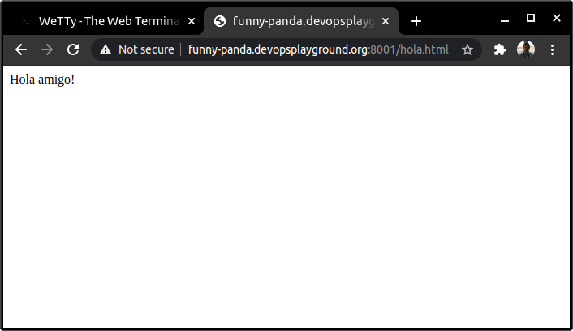

# Example 3. Using Caddy as Sidecar/Proxy for Microservices

Caddy as sidecar proxy for any kind of microservices to manage MTLS and Certificates


## Tools used

* Go
* Caddy v2 
* SmallStep Certificates (libraries already embeded in Caddy v2)
* Docker


## Preparation

Caddy can be installed as a Linux service, the [binary can be downloaded](https://caddyserver.com/download) and embedded in applications or use it in a [Docker Container](https://hub.docker.com/_/caddy). This latest option is the way we are going to use along this Lab.

#### Install Docker

If your workstation **doesn't have Docker installed and running**, please, follow these commands.

```sh
$ curl gnupg-agent software-properties-common
$ curl -fsSL https://download.docker.com/linux/ubuntu/gpg | sudo apt-key add -
$ sudo add-apt-repository "deb [arch=amd64] https://download.docker.com/linux/ubuntu $(lsb_release -cs) stable"
$ sudo apt update
$ sudo apt -y install -y docker-ce docker-ce-cli containerd.io
$ sudo usermod -a -G docker $USER
$ sudo systemctl enable docker
```

#### Caddy in Docker 

Once installed Docker we are ready to use Caddy. Then, lets download the Caddy docker image:  

```sh
$ docker pull caddy

Using default tag: latest
latest: Pulling from library/caddy
Digest: sha256:925100cc9e08c8d79ee37b36abe21d2f554982d5bf302c55a38f5da971f53431
Status: Image is up to date for caddy:latest
docker.io/library/caddy:latest
```

Checking the downloaded Caddy docker image.
```sh
$ docker images

REPOSITORY             TAG       IMAGE ID       CREATED        SIZE
caddy                  latest    88588539bb90   3 hours ago    39.5MB
codercom/code-server   latest    681a48e7bf50   3 weeks ago    838MB
wettyoss/wetty         latest    06a426b25e16   4 months ago   148MB
```
## Examples:

### I. Basic usage with Caddy in Docker.

#### 1. Serving static files with Caddy on HTTP.

Caddy is able to server static files and work as proxy at the same time. Lets check if Caddy using this feature: 
```sh
$ docker run -d -p 8001:80 \
    -v $PWD/1-basic/hola.html:/usr/share/caddy/hola.html \
    --name caddy1 \
    caddy
```

#### 2. Checking if Caddy is serving static web page.


```sh
$ curl -i http://localhost:8001/hola.html

HTTP/1.1 200 OK
Accept-Ranges: bytes
Content-Length: 12
Content-Type: text/html; charset=utf-8
Etag: "qpjzl3c"
Last-Modified: Sat, 06 Mar 2021 15:12:39 GMT
Server: Caddy
Date: Sat, 06 Mar 2021 15:19:21 GMT

Hola amigo!
```

And from a browser:




### II. Advanced Caddy configuration.


#### 1. Overwriting the Caddy config file

Running Caddy instance over the `8002` port, overwriting the Caddy config file (`/etc/caddy/Caddyfile`) and mounting `/data` and `/config` folders: 

```sh
$ cat $PWD/1-basic/Caddyfile.example1

:80

# Set this path to your site's directory.
root * /usr/share/caddy

# Enable the static file server.
file_server
```

```sh
$ docker run -d -p 8002:80 \
    -v $PWD/1-basic/hola.html:/usr/share/caddy/hola.html \
    -v $PWD/1-basic/Caddyfile.example1:/etc/caddy/Caddyfile \
    --name caddy2 \
    caddy

$ curl http://localhost:8002/hola.html

Hola amigo!
```

#### 2. Exploring Caddy docker process.

```sh
$ docker exec -it caddy2 ls -la /config/caddy/
total 12
drwxr-xr-x    2 root     root          4096 Mar  6 15:58 .
drwxr-xr-x    3 root     root          4096 Mar  6 15:58 ..
-rw-------    1 root     root           184 Mar  6 16:07 autosave.json

$ docker exec -it caddy2 ls -la /data/caddy/
total 8
drwxr-xr-x    2 root     root          4096 Mar  6 08:10 .
drwxr-xr-x    3 root     root          4096 Mar  6 11:31 ..

$ docker exec -it caddy2 ls -la /usr/share/caddy/
total 28
drwxr-xr-x    1 root     root          4096 Mar  6 16:02 .
drwxr-xr-x    1 root     root          4096 Mar  6 08:10 ..
-rw-r--r--    1 1001     root            12 Mar  6 15:12 hola.html
-rw-r--r--    1 root     root         12226 Mar  6 08:10 index.html
```

* `/config/caddy/` - It is the directory where the Caddy configuration is saved.
* `/data/caddy/` - It is the directory where the Caddy data (certificates, CA, etc.) is saved.
* `/usr/share/caddy/` - It is the directory where the static web page is saved.
All above directories can be mounted.  

Caddy can [generate formated logs](https://caddyserver.com/docs/caddyfile/directives/log), but in this lab the Docker' stdout is enough:
```sh
$ docker logs -f caddy2

```
Or tail the log file is stored in the Docker engine directory.
```sh
$ CONTAINER_ID=$(docker inspect --format="{{.Id}}" caddy2)
$ sudo tail -f  /var/lib/docker/containers/${CONTAINER_ID}/${CONTAINER_ID}-json.log | jq '.'
```

#### 3. Checking the running Caddy docker instances.

```sh
$ docker ps

CONTAINER ID   IMAGE                         COMMAND                  CREATED         STATUS         PORTS                                     NAMES
04f2635e574e   caddy                         "caddy run --config …"   6 seconds ago   Up 4 seconds   443/tcp, 2019/tcp, 0.0.0.0:8002->80/tcp   caddy2
5039cb97b9dc   caddy                         "caddy run --config …"   2 minutes ago   Up 2 minutes   443/tcp, 2019/tcp, 0.0.0.0:8001->80/tcp   caddy1
6a72db4c85ee   codercom/code-server:latest   "/usr/bin/entrypoint…"   4 minutes ago   Up 4 minutes   0.0.0.0:8000->8080/tcp                    code-server
545f1d109483   wettyoss/wetty                "yarn docker-entrypo…"   5 minutes ago   Up 5 minutes   0.0.0.0:80->3000/tcp                      wetty
```

Remove recently created container instances:  
```sh
$ docker rm -f caddy1 caddy2
```


### III. Caddy as HTTP Proxy.

We are going to configure Caddy as a Proxy (no as `file_server`) listening on `9080` to expose Kuard ([Demo application for "Kubernetes Up and Running"](https://github.com/kubernetes-up-and-running/kuard)) running `9070` port.

#### 1. Running Kuard

```sh
$ docker run -d -p 9070:8080 \
    --name kuard \
    gcr.io/kuar-demo/kuard-amd64:1

$ curl http://localhost:9070/healthy

ok
```
And from your browser, you should see this:


#### 2. Update Caddyfile

```sh
$ nano $PWD/1-basic/Caddyfile.example2
```

```sh
localhost:9080

reverse_proxy localhost:9070
```

#### 3. Running Caddy as Proxy

```sh
$ mkdir caddy_data caddy_config

$ docker run -d -p 9090:9080 \
    -v $PWD/1-basic/Caddyfile.example2:/etc/caddy/Caddyfile \
    -v $PWD/caddy_data:/data \
    -v $PWD/caddy_config:/config \
    --name caddy3 \
    caddy
```

Checking all Docker processes:
```sh
$ docker ps -a

CONTAINER ID   IMAGE                            COMMAND                  CREATED          STATUS          PORTS                                               NAMES
ba5e5996dd56   caddy                            "caddy run --config …"   27 seconds ago   Up 26 seconds   80/tcp, 443/tcp, 2019/tcp, 0.0.0.0:9090->9080/tcp   caddy3
0a4c5846c075   gcr.io/kuar-demo/kuard-amd64:1   "/kuard"                 3 minutes ago    Up 3 minutes    0.0.0.0:9070->8080/tcp                              kuard
04f2635e574e   caddy                            "caddy run --config …"   4 minutes ago    Up 4 minutes    443/tcp, 2019/tcp, 0.0.0.0:8002->80/tcp             caddy2
5039cb97b9dc   caddy                            "caddy run --config …"   7 minutes ago    Up 7 minutes    443/tcp, 2019/tcp, 0.0.0.0:8001->80/tcp             caddy1
6a72db4c85ee   codercom/code-server:latest      "/usr/bin/entrypoint…"   9 minutes ago    Up 9 minutes    0.0.0.0:8000->8080/tcp                              code-server
545f1d109483   wettyoss/wetty                   "yarn docker-entrypo…"   9 minutes ago    Up 9 minutes    0.0.0.0:80->3000/tcp                                wetty
```

#### 4. Calling Kuard through Proxy.

From your remote workstation:
```sh
$ curl -ik https://localhost:9090/healthy

HTTP/2 502 
server: Caddy
content-length: 0
date: Sun, 07 Mar 2021 16:45:15 GMT
```

From your local computer using a browser:  


Open other Wetty terminal in your remote workstation and tail the caddy logs to check what is happening:

```sh
$ CONTAINER_ID=$(docker inspect --format="{{.Id}}" caddy3)
$ sudo tail -f  /var/lib/docker/containers/${CONTAINER_ID}/${CONTAINER_ID}-json.log | jq
```

You should see below events:
```sh
{
  "log": "{\"level\":\"info\",\"ts\":1615135216.280893,\"logger\":\"http\",\"msg\":\"enabling automatic HTTP->HTTPS redirects\",\"server_name\":\"srv0\"}\n",
  "stream": "stderr",
  "time": "2021-03-07T16:40:16.280962002Z"
}
{
  "log": "{\"level\":\"info\",\"ts\":1615135216.2920134,\"logger\":\"tls\",\"msg\":\"cleaned up storage units\"}\n",
  "stream": "stderr",
  "time": "2021-03-07T16:40:16.292152705Z"
}
{
  "log": "{\"level\":\"warn\",\"ts\":1615135216.3346677,\"logger\":\"pki.ca.local\",\"msg\":\"installing root certificate (you might be prompted for password)\",\"path\":\"storage:pki/authorities/local/root.crt\"}\n",
  "stream": "stderr",
  "time": "2021-03-07T16:40:16.334789684Z"
}
{
  "log": "2021/03/07 16:40:16 Warning: \"certutil\" is not available, install \"certutil\" with \"apt install libnss3-tools\" or \"yum install nss-tools\" and try again\n",
  "stream": "stderr",
  "time": "2021-03-07T16:40:16.335845351Z"
}
{
  "log": "2021/03/07 16:40:16 define JAVA_HOME environment variable to use the Java trust\n",
  "stream": "stderr",
  "time": "2021-03-07T16:40:16.335864671Z"
}
{
  "log": "2021/03/07 16:40:16 certificate installed properly in linux trusts\n",
  "stream": "stderr",
  "time": "2021-03-07T16:40:16.384457934Z"
}
{
  "log": "{\"level\":\"info\",\"ts\":1615135216.3852265,\"logger\":\"http\",\"msg\":\"enabling automatic TLS certificate management\",\"domains\":[\"localhost\"]}\n",
  "stream": "stderr",
  "time": "2021-03-07T16:40:16.385307403Z"
}
{
  "log": "{\"level\":\"warn\",\"ts\":1615135216.3862777,\"logger\":\"tls\",\"msg\":\"stapling OCSP\",\"error\":\"no OCSP stapling for [localhost]: no OCSP server specified in certificate\"}\n",
  "stream": "stderr",
  "time": "2021-03-07T16:40:16.386346961Z"
}
{
  "log": "{\"level\":\"info\",\"ts\":1615135216.3865528,\"msg\":\"autosaved config\",\"file\":\"/config/caddy/autosave.json\"}\n",
  "stream": "stderr",
  "time": "2021-03-07T16:40:16.386631138Z"
}
{
  "log": "{\"level\":\"info\",\"ts\":1615135216.386753,\"msg\":\"serving initial configuration\"}\n",
  "stream": "stderr",
  "time": "2021-03-07T16:40:16.386840201Z"
}
{
  "log": "{\"level\":\"error\",\"ts\":1615135306.509363,\"logger\":\"http.log.error\",\"msg\":\"dial tcp 127.0.0.1:9070: connect: connection refused\",\"request\":{\"remote_addr\":\"172.17.0.1:51436\",\"proto\":\"HTTP/2.0\",\"method\":\"GET\",\"host\":\"localhost:9090\",\"uri\":\"/healthy\",\"headers\":{\"User-Agent\":[\"curl/7.58.0\"],\"Accept\":[\"*/*\"]},\"tls\":{\"resumed\":false,\"version\":772,\"cipher_suite\":4865,\"proto\":\"h2\",\"proto_mutual\":true,\"server_name\":\"localhost\"}},\"duration\":0.000472143,\"status\":502,\"err_id\":\"x41mreg93\",\"err_trace\":\"reverseproxy.statusError (reverseproxy.go:783)\"}\n",
  "stream": "stderr",
  "time": "2021-03-07T16:41:46.509521725Z"
}
```

__What is the problem?__   
* We are having `reverseproxy.statusError`, that means the Caddy container is working as proxy but it can not route the traffic to the Kuard container.
* The Caddy container is trying to route the traffic from `localhost:9080` to `reverse_proxy localhost:9070`.
* This error makes sense because Caddy and Kuard are running in the Docker Network and hostnames like `127.0.0.1` and `localhost` are not the right IP addresses or Hostnames that docker instances have. This is the normal behaviour of running services in Docker containers, they will be running in an isolated manner. Then, to establish communication between 2 containers, we need to do it through the Docker Network.


#### 5. Creating a Docker Network and add both containers.

We are going to create the `lab3-net` Docker Network and add `caddy3` and `kuard` containers.
```sh
$ docker network create lab3-net
$ docker network connect lab3-net caddy3
$ docker network connect lab3-net kuard
```

Checking the `lab3-net` Docker Network. You should see the Subnet addresses, the Gateway, the Network type and intarnal containers' IP addresses and assigned hostnames.
```sh
$ docker network inspect lab3-net | jq
```

```sh
[
  {
    "Name": "lab3-net",
    "Id": "d4dc72571f42b9352fbf9161026071613e55b171e8f267341fc5966f8758ab78",
    "Created": "2021-03-07T18:53:25.85471742Z",
    "Scope": "local",
    "Driver": "bridge",
    "EnableIPv6": false,
    "IPAM": {
      "Driver": "default",
      "Options": {},
      "Config": [
        {
          "Subnet": "172.19.0.0/16",
          "Gateway": "172.19.0.1"
        }
      ]
    },
    "Internal": false,
    "Attachable": false,
    "Ingress": false,
    "ConfigFrom": {
      "Network": ""
    },
    "ConfigOnly": false,
    "Containers": {
      "8b28b69d43e9de7601a1dc54329bc483e7d83bedbc7daf61205829a328563143": {
        "Name": "kuard",
        "EndpointID": "8e8cc31f37978bf26e099aa1eeabf2ad830e2e50e7d7b26272adbdd7bb839f97",
        "MacAddress": "02:42:ac:13:00:03",
        "IPv4Address": "172.19.0.3/16",
        "IPv6Address": ""
      },
      "af622019979718bdcccaa563cb8f95dfd89a105ff27eb8ef5f21554f0de524f5": {
        "Name": "caddy3",
        "EndpointID": "05528bda1c7e6d7b0fcb07be88619fc8e615f96dc8510bd91422b3a1876cd57b",
        "MacAddress": "02:42:ac:13:00:02",
        "IPv4Address": "172.19.0.2/16",
        "IPv6Address": ""
      }
    },
    "Options": {},
    "Labels": {}
  }
]
```

And finally, you will be able to reach using internal IP address or hostname (it is the value assigned to `--name` when the container was created) to any container associated to `lab3-net` network.
```sh
$ docker exec -it caddy3 ping kuard

PING kuard (172.19.0.3): 56 data bytes
64 bytes from 172.19.0.3: seq=0 ttl=64 time=0.108 ms
64 bytes from 172.19.0.3: seq=1 ttl=64 time=0.095 ms
64 bytes from 172.19.0.3: seq=2 ttl=64 time=0.093 ms
^C
--- kuard ping statistics ---
3 packets transmitted, 3 packets received, 0% packet loss
round-trip min/avg/max = 0.093/0.098/0.108 ms
``` 

The above information means that `caddy3` and `kuard` containers are part of same Docker network and we can call our service through the proxy.

#### 6. Trying to call Kuard through Proxy.

We need to do make a slight change to `$PWD/1-basic/Caddyfile.example2`.
```sh
{
    debug
}
localhost:9080

## kuard is the docker name
## 8080 is the standard port that kuard use (it isn't docker port)
reverse_proxy kuard:8080
```

With these changes, redeploy the `caddy3` container.

```sh
$ docker rm -f caddy3

$ docker run -d -p 9090:9080 \
    -v $PWD/1-basic/Caddyfile.example2:/etc/caddy/Caddyfile \
    -v $PWD/caddy_data:/data \
    -v $PWD/caddy_config:/config \
    --name caddy3 \
    --net lab3-net \
    caddy
```
You will note the above command will create `caddy3` container and will add it into the `lab3-net` docker network.  

Check the `caddy3` docker logs:   
```sh
$ CONTAINER_ID=$(docker inspect --format="{{.Id}}" caddy3)

$ sudo tail -fn 1000  /var/lib/docker/containers/${CONTAINER_ID}/${CONTAINER_ID}-json.log | jq 

{
  "log": "{\"level\":\"info\",\"ts\":1615153359.6446476,\"msg\":\"using provided configuration\",\"config_file\":\"/etc/caddy/Caddyfile\",\"config_adapter\":\"caddyfile\"}\n",
  "stream": "stderr",
  "time": "2021-03-07T21:42:39.644814428Z"
}
{
  "log": "{\"level\":\"info\",\"ts\":1615153359.646472,\"logger\":\"admin\",\"msg\":\"admin endpoint started\",\"address\":\"tcp/localhost:2019\",\"enforce_origin\":false,\"origins\":[\"localhost:2019\",\"[::1]:2019\",\"127.0.0.1:2019\"]}\n",
  "stream": "stderr",
  "time": "2021-03-07T21:42:39.646537544Z"
}
{
  "log": "{\"level\":\"info\",\"ts\":1615153359.6476705,\"logger\":\"http\",\"msg\":\"enabling automatic HTTP->HTTPS redirects\",\"server_name\":\"srv0\"}\n",
  "stream": "stderr",
  "time": "2021-03-07T21:42:39.64790584Z"
}
{
  "log": "{\"level\":\"info\",\"ts\":1615153359.6498604,\"logger\":\"tls.cache.maintenance\",\"msg\":\"started background certificate maintenance\",\"cache\":\"0xc0002ce310\"}\n",
  "stream": "stderr",
  "time": "2021-03-07T21:42:39.649920521Z"
}
{
  "log": "{\"level\":\"info\",\"ts\":1615153359.6611228,\"logger\":\"tls\",\"msg\":\"cleaned up storage units\"}\n",
  "stream": "stderr",
  "time": "2021-03-07T21:42:39.661210905Z"
}
{
  "log": "{\"level\":\"warn\",\"ts\":1615153359.7193143,\"logger\":\"pki.ca.local\",\"msg\":\"installing root certificate (you might be prompted for password)\",\"path\":\"storage:pki/authorities/local/root.crt\"}\n",
  "stream": "stderr",
  "time": "2021-03-07T21:42:39.719438806Z"
}
{
  "log": "2021/03/07 21:42:39 define JAVA_HOME environment variable to use the Java trust\n",
  "stream": "stderr",
  "time": "2021-03-07T21:42:39.71999834Z"
}
{
  "log": "2021/03/07 21:42:39 Warning: \"certutil\" is not available, install \"certutil\" with \"apt install libnss3-tools\" or \"yum install nss-tools\" and try again\n",
  "stream": "stderr",
  "time": "2021-03-07T21:42:39.720045566Z"
}
{
  "log": "2021/03/07 21:42:39 certificate installed properly in linux trusts\n",
  "stream": "stderr",
  "time": "2021-03-07T21:42:39.751433802Z"
}
{
  "log": "{\"level\":\"debug\",\"ts\":1615153359.751695,\"logger\":\"http\",\"msg\":\"starting server loop\",\"address\":\"[::]:9080\",\"http3\":false,\"tls\":true}\n",
  "stream": "stderr",
  "time": "2021-03-07T21:42:39.751762832Z"
}
{
  "log": "{\"level\":\"debug\",\"ts\":1615153359.7517471,\"logger\":\"http\",\"msg\":\"starting server loop\",\"address\":\"[::]:80\",\"http3\":false,\"tls\":false}\n",
  "stream": "stderr",
  "time": "2021-03-07T21:42:39.75184962Z"
}
{
  "log": "{\"level\":\"info\",\"ts\":1615153359.7517562,\"logger\":\"http\",\"msg\":\"enabling automatic TLS certificate management\",\"domains\":[\"localhost\"]}\n",
  "stream": "stderr",
  "time": "2021-03-07T21:42:39.751859786Z"
}
{
  "log": "{\"level\":\"warn\",\"ts\":1615153359.7523851,\"logger\":\"tls\",\"msg\":\"stapling OCSP\",\"error\":\"no OCSP stapling for [localhost]: no OCSP server specified in certificate\"}\n",
  "stream": "stderr",
  "time": "2021-03-07T21:42:39.752447258Z"
}
{
  "log": "{\"level\":\"info\",\"ts\":1615153359.7525363,\"msg\":\"autosaved config\",\"file\":\"/config/caddy/autosave.json\"}\n",
  "stream": "stderr",
  "time": "2021-03-07T21:42:39.752581438Z"
}
{
  "log": "{\"level\":\"info\",\"ts\":1615153359.752552,\"msg\":\"serving initial configuration\"}\n",
  "stream": "stderr",
  "time": "2021-03-07T21:42:39.752591238Z"
}
```
According the logs, Caddy has generated a TLS certificate (and key-pair) for `caddy3` running on `localhost`, then we are ready to call the service over HTTPS.
Let's call to `kuard` container over HTTPS.   
```sh
$ curl https://localhost:9090/healthy

curl: (60) SSL certificate problem: unable to get local issuer certificate
More details here: https://curl.haxx.se/docs/sslcerts.html

curl failed to verify the legitimacy of the server and therefore could not
establish a secure connection to it. To learn more about this situation and
how to fix it, please visit the web page mentioned above.
```

Let's call again to `kuard` container over HTTPS but bypassing the validation of server certificate.   
```sh
$ curl -ivk https://localhost:9090/healthy

*   Trying 127.0.0.1...
* TCP_NODELAY set
* Connected to localhost (127.0.0.1) port 9090 (#0)
* ALPN, offering h2
* ALPN, offering http/1.1
* successfully set certificate verify locations:
*   CAfile: /etc/ssl/certs/ca-certificates.crt
  CApath: /etc/ssl/certs
* TLSv1.3 (OUT), TLS handshake, Client hello (1):
* TLSv1.3 (IN), TLS handshake, Server hello (2):
* TLSv1.3 (IN), TLS Unknown, Certificate Status (22):
* TLSv1.3 (IN), TLS handshake, Unknown (8):
* TLSv1.3 (IN), TLS Unknown, Certificate Status (22):
* TLSv1.3 (IN), TLS handshake, Certificate (11):
* TLSv1.3 (IN), TLS Unknown, Certificate Status (22):
* TLSv1.3 (IN), TLS handshake, CERT verify (15):
* TLSv1.3 (IN), TLS Unknown, Certificate Status (22):
* TLSv1.3 (IN), TLS handshake, Finished (20):
* TLSv1.3 (OUT), TLS change cipher, Client hello (1):
* TLSv1.3 (OUT), TLS Unknown, Certificate Status (22):
* TLSv1.3 (OUT), TLS handshake, Finished (20):
* SSL connection using TLSv1.3 / TLS_AES_128_GCM_SHA256
* ALPN, server accepted to use h2
* Server certificate:
*  subject: [NONE]
*  start date: Mar  7 17:33:31 2021 GMT
*  expire date: Mar  8 05:33:31 2021 GMT
*  issuer: CN=Caddy Local Authority - ECC Intermediate
*  SSL certificate verify result: unable to get local issuer certificate (20), continuing anyway.
* Using HTTP2, server supports multi-use
* Connection state changed (HTTP/2 confirmed)
* Copying HTTP/2 data in stream buffer to connection buffer after upgrade: len=0
* TLSv1.3 (OUT), TLS Unknown, Unknown (23):
* TLSv1.3 (OUT), TLS Unknown, Unknown (23):
* TLSv1.3 (OUT), TLS Unknown, Unknown (23):
* Using Stream ID: 1 (easy handle 0x556b4a537600)
* TLSv1.3 (OUT), TLS Unknown, Unknown (23):
> GET /healthy HTTP/2
> Host: localhost:9090
> User-Agent: curl/7.58.0
> Accept: */*
> 
* TLSv1.3 (IN), TLS Unknown, Certificate Status (22):
* TLSv1.3 (IN), TLS handshake, Newsession Ticket (4):
* TLSv1.3 (IN), TLS Unknown, Unknown (23):
* Connection state changed (MAX_CONCURRENT_STREAMS updated)!
* TLSv1.3 (OUT), TLS Unknown, Unknown (23):
* TLSv1.3 (IN), TLS Unknown, Unknown (23):
* TLSv1.3 (IN), TLS Unknown, Unknown (23):
< HTTP/2 200 
HTTP/2 200 
< content-type: text/plain
content-type: text/plain
< date: Sun, 07 Mar 2021 22:14:34 GMT
date: Sun, 07 Mar 2021 22:14:34 GMT
< server: Caddy
server: Caddy
< content-length: 2
content-length: 2

< 
* TLSv1.3 (IN), TLS Unknown, Unknown (23):
* Connection #0 to host localhost left intact

ok
```
#### 7. Call Kuard through Proxy from a browser.

You will see the same error message you got when both containers are not part of the same Docker network.   


And if you check the `caddy3` docker logs, you will see the error:   
```sh
$ sudo tail -fn 1000  /var/lib/docker/containers/${CONTAINER_ID}/${CONTAINER_ID}-json.log | jq 
```
```sh
{
  "log": "{\"level\":\"debug\",\"ts\":1615155607.5234804,\"logger\":\"http.stdlib\",\"msg\":\"http: TLS handshake error from 83.54.18.132:34204: no certificate available for 'funny-panda.devopsplayground.org'\"}\n",
  "stream": "stderr",
  "time": "2021-03-07T22:20:07.523665941Z"
}
```
It means the Chrome can not load the page because the certificate that Caddy generated doesn't match the FQDN used to call the `kuard` service.
Caddy embeds a internal PKI only to generate internal certificates (i.e. certificate for `locahost`) and it can not establish TLS connection because that certificate was issued to `localhost`, not to `funny-panda.devopsplayground.org`.
Then, let's update `caddy3` and get a proper certificate for `funny-panda.devopsplayground.org`.

### IV. Test One-way TLS.

#### 1. Update Caddyfile to use the FQDN.

Add a slight change to `$PWD/1-basic/Caddyfile.example2`.
```sh
{
    debug
}
## replace localhost for the fqdn
funny-panda.devopsplayground.org:9080

reverse_proxy kuard:8080
```

#### 2. Redeploy Caddy.
Once updated, redeploy the `caddy3` container.

```sh
$ docker rm -f caddy3

$ docker run -d -p 9090:9080 \
    -v $PWD/1-basic/Caddyfile.example2:/etc/caddy/Caddyfile \
    -v $PWD/caddy_data:/data \
    -v $PWD/caddy_config:/config \
    --name caddy3 \
    --net lab3-net \
    caddy
```

#### 3. Check the Caddy logs.

```sh
$ CONTAINER_ID=$(docker inspect --format="{{.Id}}" caddy3)

$ sudo tail -fn 1000  /var/lib/docker/containers/${CONTAINER_ID}/${CONTAINER_ID}-json.log | jq 

[...]
{
  "log": "{\"level\":\"info\",\"ts\":1615159892.8294432,\"logger\":\"tls.obtain\",\"msg\":\"certificate obtained successfully\",\"identifier\":\"funny-panda.devopsplayground.org\"}\n",
  "stream": "stderr",
  "time": "2021-03-07T23:31:32.829497212Z"
}
{
  "log": "{\"level\":\"info\",\"ts\":1615159892.829536,\"logger\":\"tls.obtain\",\"msg\":\"releasing lock\",\"identifier\":\"funny-panda.devopsplayground.org\"}\n",
  "stream": "stderr",
  "time": "2021-03-07T23:31:32.829565267Z"
}
{
  "log": "{\"level\":\"debug\",\"ts\":1615159892.8301756,\"logger\":\"tls\",\"msg\":\"loading managed certificate\",\"domain\":\"funny-panda.devopsplayground.org\",\"expiration\":1622932292,\"issuer_key\":\"acme-v02.api.letsencrypt.org-directory\",\"storage\":\"FileStorage:/data/caddy\"}\n",
  "stream": "stderr",
  "time": "2021-03-07T23:31:32.830220434Z"
}
```

#### 4. Call the service through the Caddy proxy.

Call the service from Wetty using curl:   
```sh
$ curl -v https://funny-panda.devopsplayground.org:9090/healthy

*   Trying 35.179.96.88...
* TCP_NODELAY set
* Connected to funny-panda.devopsplayground.org (35.179.96.88) port 9090 (#0)
* ALPN, offering h2
* ALPN, offering http/1.1
* successfully set certificate verify locations:
*   CAfile: /etc/ssl/certs/ca-certificates.crt
  CApath: /etc/ssl/certs
* TLSv1.3 (OUT), TLS handshake, Client hello (1):
* TLSv1.3 (IN), TLS handshake, Server hello (2):
* TLSv1.3 (IN), TLS Unknown, Certificate Status (22):
* TLSv1.3 (IN), TLS handshake, Unknown (8):
* TLSv1.3 (IN), TLS Unknown, Certificate Status (22):
* TLSv1.3 (IN), TLS handshake, Certificate (11):
* TLSv1.3 (IN), TLS Unknown, Certificate Status (22):
* TLSv1.3 (IN), TLS handshake, CERT verify (15):
* TLSv1.3 (IN), TLS Unknown, Certificate Status (22):
* TLSv1.3 (IN), TLS handshake, Finished (20):
* TLSv1.3 (OUT), TLS change cipher, Client hello (1):
* TLSv1.3 (OUT), TLS Unknown, Certificate Status (22):
* TLSv1.3 (OUT), TLS handshake, Finished (20):
* SSL connection using TLSv1.3 / TLS_AES_128_GCM_SHA256
* ALPN, server accepted to use h2
* Server certificate:
*  subject: CN=funny-panda.devopsplayground.org
*  start date: Mar  7 22:31:32 2021 GMT
*  expire date: Jun  5 22:31:32 2021 GMT
*  subjectAltName: host "funny-panda.devopsplayground.org" matched cert's "funny-panda.devopsplayground.org"
*  issuer: C=US; O=Let's Encrypt; CN=R3
*  SSL certificate verify ok.
* Using HTTP2, server supports multi-use
* Connection state changed (HTTP/2 confirmed)
* Copying HTTP/2 data in stream buffer to connection buffer after upgrade: len=0
* TLSv1.3 (OUT), TLS Unknown, Unknown (23):
* TLSv1.3 (OUT), TLS Unknown, Unknown (23):
* TLSv1.3 (OUT), TLS Unknown, Unknown (23):
* Using Stream ID: 1 (easy handle 0x55791238e600)
* TLSv1.3 (OUT), TLS Unknown, Unknown (23):
> GET /healthy HTTP/2
> Host: funny-panda.devopsplayground.org:9090
> User-Agent: curl/7.58.0
> Accept: */*
> 
* TLSv1.3 (IN), TLS Unknown, Certificate Status (22):
* TLSv1.3 (IN), TLS handshake, Newsession Ticket (4):
* TLSv1.3 (IN), TLS Unknown, Unknown (23):
* Connection state changed (MAX_CONCURRENT_STREAMS updated)!
* TLSv1.3 (OUT), TLS Unknown, Unknown (23):
* TLSv1.3 (IN), TLS Unknown, Unknown (23):
* TLSv1.3 (IN), TLS Unknown, Unknown (23):
* TLSv1.3 (IN), TLS Unknown, Unknown (23):
< HTTP/2 200 
< content-type: text/plain
< date: Sun, 07 Mar 2021 23:51:15 GMT
< server: Caddy
< content-length: 2
< 
* TLSv1.3 (IN), TLS Unknown, Unknown (23):
* Connection #0 to host funny-panda.devopsplayground.org left intact

ok
```

And finally, call the service from Chrome using the FQDN:   


You will see the `caddy3` is running with the IP `172.19.0.2` and `kuard` with the IP `172.19.0.3`. You can check it with this command:

```sh
$ docker network ls

NETWORK ID     NAME             DRIVER    SCOPE
a6d11919ae92   bridge           bridge    local
ca5966db93ae   host             host      local
d4dc72571f42   lab3-net         bridge    local
b564bb82a281   none             null      local
b52f92249fab   playground-net   bridge    local
```

```sh
$ docker network inspect lab3-net | jq

[
  {
    "Name": "lab3-net",
    "Id": "d4dc72571f42b9352fbf9161026071613e55b171e8f267341fc5966f8758ab78",
    "Created": "2021-03-07T18:53:25.85471742Z",
    "Scope": "local",
    "Driver": "bridge",
    "EnableIPv6": false,
    "IPAM": {
      "Driver": "default",
      "Options": {},
      "Config": [
        {
          "Subnet": "172.19.0.0/16",
          "Gateway": "172.19.0.1"
        }
      ]
    },
    "Internal": false,
    "Attachable": false,
    "Ingress": false,
    "ConfigFrom": {
      "Network": ""
    },
    "ConfigOnly": false,
    "Containers": {
      "8b28b69d43e9de7601a1dc54329bc483e7d83bedbc7daf61205829a328563143": {
        "Name": "kuard",
        "EndpointID": "8e8cc31f37978bf26e099aa1eeabf2ad830e2e50e7d7b26272adbdd7bb839f97",
        "MacAddress": "02:42:ac:13:00:03",
        "IPv4Address": "172.19.0.3/16",
        "IPv6Address": ""
      },
      "da9ebfad457e735443db184df79b577f94109d12fa764232fede2a17f6d1c981": {
        "Name": "caddy3",
        "EndpointID": "378c937c6064b48c72bd7de4a67cab95482aee696f025d2a7beb19ad8945c24d",
        "MacAddress": "02:42:ac:13:00:02",
        "IPv4Address": "172.19.0.2/16",
        "IPv6Address": ""
      }
    },
    "Options": {},
    "Labels": {}
  }
]
```


### V. Test Two-way TLS (Mutual TLS authentication).

MTLS requires generate a client certificate (and key-pair) installed in the Client (Chrome or any browser) certificate store and enable the Caddy TLS policy to require present a valid client certificate during the TLS handshake.


#### 1. Generate a client certificate.

```sh
$ cd ../2-hello-go/

$ ./openssl_gen_certs.sh cleanup

$ ./openssl_gen_certs.sh client-lab3 secret

$ openssl pkcs12 -export \
    -out 4_client/certs/client-lab3.pfx \
    -inkey 4_client/private/client-lab3.key.pem \
    -in 4_client/certs/client-lab3.cert.pem \
    -passin pass:secret \
    -passout pass:secret

$ mkdir -p ../3-caddy-sidecar/caddy_config/custom-certs/
$ cp 2_intermediate/certs/ca-chain.cert.pem ../3-caddy-sidecar/caddy_config/custom-certs/.
$ cp 2_intermediate/certs/intermediate.cert.pem ../3-caddy-sidecar/caddy_config/custom-certs/.
```


#### 2. Update Caddyfile

```sh
$ cd ../3-caddy-sidecar/

$ nano $PWD/1-basic/Caddyfile.mtls
```

```sh
{
    debug
}
(mTLS) {
    tls {
        client_auth {
            mode require_and_verify
            trusted_ca_cert_file /config/custom-certs/ca-chain.cert.pem
        }
    }
}

funny-panda.devopsplayground.org:9081 {
    reverse_proxy kuard:8080
    import mTLS
}
```


#### 3. Create a new Caddy docker instance

```sh
$ docker rm -f caddy4

$ docker run -d -p 9091:9081 \
    -v $PWD/1-basic/Caddyfile.mtls:/etc/caddy/Caddyfile \
    -v $PWD/caddy_data:/data \
    -v $PWD/caddy_config:/config \
    --name caddy4 \
    --net lab3-net \
    caddy
```

Check the `caddy4` logs:   
```sh
$ CONTAINER_ID4=$(docker inspect --format="{{.Id}}" caddy4)

$ sudo tail -fn 1000  /var/lib/docker/containers/${CONTAINER_ID4}/${CONTAINER_ID4}-json.log | jq 
```

```sh
[...]

```


#### 4. Call the service and check MTLS


From Wetty using curl:
```sh
$ FQDN="funny-panda.devopsplayground.org"

$ curl --cacert caddy_data/caddy/certificates/acme-v02.api.letsencrypt.org-directory/${FQDN}/${FQDN}.crt \
       --cert ../2-hello-go/4_client/certs/client-lab3.cert.pem:secret \
       --key ../2-hello-go/4_client/private/client-lab3.key.pem \
       https://${FQDN}:9091/healthy

```

From Chrome:


Check the `caddy4` logs:   
```sh
$ CONTAINER_ID4=$(docker inspect --format="{{.Id}}" caddy4)

$ sudo tail -fn 1000  /var/lib/docker/containers/${CONTAINER_ID4}/${CONTAINER_ID4}-json.log | jq 
```

```sh
[...]
{
  "log": "{\"level\":\"info\",\"ts\":1615165875.9552908,\"msg\":\"serving initial configuration\"}\n",
  "stream": "stderr",
  "time": "2021-03-08T01:11:15.95544693Z"
}
{
  "log": "{\"level\":\"debug\",\"ts\":1615166146.184904,\"logger\":\"http.stdlib\",\"msg\":\"http: TLS handshake error from 35.179.96.88:46116: EOF\"}\n",
  "stream": "stderr",
  "time": "2021-03-08T01:15:46.185113207Z"
}
{
  "log": "{\"level\":\"debug\",\"ts\":1615166244.1928227,\"logger\":\"http.stdlib\",\"msg\":\"http: TLS handshake error from 83.54.18.132:39742: EOF\"}\n",
  "stream": "stderr",
  "time": "2021-03-08T01:17:24.192993722Z"
}
{
  "log": "{\"level\":\"debug\",\"ts\":1615166244.2752433,\"logger\":\"http.stdlib\",\"msg\":\"http: TLS handshake error from 83.54.18.132:39744: tls: client didn't provide a certificate\"}\n",
  "stream": "stderr",
  "time": "2021-03-08T01:17:24.275433878Z"
}

```

Let's install the client certificate in Chrome's certificate store.


The server will ask to send the client certificate:


And finally, you should see the `caddy4` logs:

```sh
[...]
{
  "log": "{\"level\":\"debug\",\"ts\":1615167728.540429,\"logger\":\"http.stdlib\",\"msg\":\"http: TLS handshake error from 83.54.18.132:40016: EOF\"}\n",
  "stream": "stderr",
  "time": "2021-03-08T01:42:08.54063686Z"
}
{
  "log": "{\"level\":\"debug\",\"ts\":1615167733.9479635,\"logger\":\"http.handlers.reverse_proxy\",\"msg\":\"upstream roundtrip\",\"upstream\":\"kuard:8080\",\"request\":{\"remote_addr\":\"83.54.18.132:40018\",\"proto\":\"HTTP/2.0\",\"method\":\"GET\",\"host\":\"funny-panda.devopsplayground.org:9091\",\"uri\":\"/\",\"headers\":{\"Sec-Fetch-User\":[\"?1\"],\"Sec-Ch-Ua\":[\"\\\"Google Chrome\\\";v=\\\"89\\\", \\\"Chromium\\\";v=\\\"89\\\", \\\";Not A Brand\\\";v=\\\"99\\\"\"],\"Sec-Ch-Ua-Mobile\":[\"?0\"],\"Accept\":[\"text/html,application/xhtml+xml,application/xml;q=0.9,image/avif,image/webp,image/apng,*/*;q=0.8,application/signed-exchange;v=b3;q=0.9\"],\"Sec-Fetch-Mode\":[\"navigate\"],\"Dnt\":[\"1\"],\"Sec-Fetch-Site\":[\"none\"],\"Cookie\":[\"io=6hGzCUltLNnS-WsKAAAO\"],\"X-Forwarded-For\":[\"83.54.18.132\"],\"X-Forwarded-Proto\":[\"https\"],\"Cache-Control\":[\"max-age=0\"],\"Sec-Fetch-Dest\":[\"document\"],\"Accept-Encoding\":[\"gzip, deflate, br\"],\"Accept-Language\":[\"en-GB,en;q=0.9,ca;q=0.8,es;q=0.7,it;q=0.6\"],\"Upgrade-Insecure-Requests\":[\"1\"],\"User-Agent\":[\"Mozilla/5.0 (X11; Linux x86_64) AppleWebKit/537.36 (KHTML, like Gecko) Chrome/89.0.4389.72 Safari/537.36\"]},\"tls\":{\"resumed\":false,\"version\":772,\"cipher_suite\":4865,\"proto\":\"h2\",\"proto_mutual\":true,\"server_name\":\"funny-panda.devopsplayground.org\",\"client_common_name\":\"client-lab3\",\"client_serial\":\"1049107\"}},\"duration\":0.001654184,\"headers\":{\"Date\":[\"Mon, 08 Mar 2021 01:42:13 GMT\"],\"Content-Length\":[\"2186\"],\"Content-Type\":[\"text/html\"]},\"status\":200}\n",
  "stream": "stderr",
  "time": "2021-03-08T01:42:13.948090056Z"
}
{
  "log": "{\"level\":\"debug\",\"ts\":1615167734.0763571,\"logger\":\"http.handlers.reverse_proxy\",\"msg\":\"upstream roundtrip\",\"upstream\":\"kuard:8080\",\"request\":{\"remote_addr\":\"83.54.18.132:40018\",\"proto\":\"HTTP/2.0\",\"method\":\"GET\",\"host\":\"funny-panda.devopsplayground.org:9091\",\"uri\":\"/static/css/bootstrap.min.css\",\"headers\":{\"User-Agent\":[\"Mozilla/5.0 (X11; Linux x86_64) AppleWebKit/537.36 (KHTML, like Gecko) Chrome/89.0.4389.72 Safari/537.36\"],\"Sec-Fetch-Site\":[\"same-origin\"],\"Sec-Fetch-Dest\":[\"style\"],\"X-Forwarded-For\":[\"83.54.18.132\"],\"Sec-Ch-Ua\":[\"\\\"Google Chrome\\\";v=\\\"89\\\", \\\"Chromium\\\";v=\\\"89\\\", \\\";Not A Brand\\\";v=\\\"99\\\"\"],\"Sec-Ch-Ua-Mobile\":[\"?0\"],\"Cookie\":[\"io=6hGzCUltLNnS-WsKAAAO\"],\"Referer\":[\"https://funny-panda.devopsplayground.org:9091/\"],\"Accept-Encoding\":[\"gzip, deflate, br\"],\"Accept-Language\":[\"en-GB,en;q=0.9,ca;q=0.8,es;q=0.7,it;q=0.6\"],\"X-Forwarded-Proto\":[\"https\"],\"Dnt\":[\"1\"],\"Accept\":[\"text/css,*/*;q=0.1\"],\"Sec-Fetch-Mode\":[\"no-cors\"]},\"tls\":{\"resumed\":false,\"version\":772,\"cipher_suite\":4865,\"proto\":\"h2\",\"proto_mutual\":true,\"server_name\":\"funny-panda.devopsplayground.org\",\"client_common_name\":\"client-lab3\",\"client_serial\":\"1049107\"}},\"duration\":0.003203312,\"headers\":{\"Accept-Ranges\":[\"bytes\"],\"Content-Length\":[\"144292\"],\"Content-Type\":[\"text/css; charset=utf-8\"],\"Last-Modified\":[\"Thu, 16 Nov 2017 22:09:48 GMT\"],\"Date\":[\"Mon, 08 Mar 2021 01:42:14 GMT\"]},\"status\":200}\n",
  "stream": "stderr",
  "time": "2021-03-08T01:42:14.076453038Z"
}
{
  "log": "{\"level\":\"debug\",\"ts\":1615167734.0786808,\"logger\":\"http.handlers.reverse_proxy\",\"msg\":\"upstream roundtrip\",\"upstream\":\"kuard:8080\",\"request\":{\"remote_addr\":\"83.54.18.132:40018\",\"proto\":\"HTTP/2.0\",\"method\":\"GET\",\"host\":\"funny-panda.devopsplayground.org:9091\",\"uri\":\"/static/css/styles.css\",\"headers\":{\"Sec-Fetch-Mode\":[\"no-cors\"],\"Dnt\":[\"1\"],\"Accept\":[\"text/css,*/*;q=0.1\"],\"Sec-Fetch-Site\":[\"same-origin\"],\"User-Agent\":[\"Mozilla/5.0 (X11; Linux x86_64) AppleWebKit/537.36 (KHTML, like Gecko) Chrome/89.0.4389.72 Safari/537.36\"],\"Accept-Language\":[\"en-GB,en;q=0.9,ca;q=0.8,es;q=0.7,it;q=0.6\"],\"Cookie\":[\"io=6hGzCUltLNnS-WsKAAAO\"],\"X-Forwarded-For\":[\"83.54.18.132\"],\"X-Forwarded-Proto\":[\"https\"],\"Sec-Ch-Ua\":[\"\\\"Google Chrome\\\";v=\\\"89\\\", \\\"Chromium\\\";v=\\\"89\\\", \\\";Not A Brand\\\";v=\\\"99\\\"\"],\"Sec-Fetch-Dest\":[\"style\"],\"Accept-Encoding\":[\"gzip, deflate, br\"],\"Sec-Ch-Ua-Mobile\":[\"?0\"],\"Referer\":[\"https://funny-panda.devopsplayground.org:9091/\"]},\"tls\":{\"resumed\":false,\"version\":772,\"cipher_suite\":4865,\"proto\":\"h2\",\"proto_mutual\":true,\"server_name\":\"funny-panda.devopsplayground.org\",\"client_common_name\":\"client-lab3\",\"client_serial\":\"1049107\"}},\"duration\":0.00268869,\"headers\":{\"Accept-Ranges\":[\"bytes\"],\"Content-Length\":[\"1585\"],\"Content-Type\":[\"text/css; charset=utf-8\"],\"Last-Modified\":[\"Thu, 16 Nov 2017 22:09:48 GMT\"],\"Date\":[\"Mon, 08 Mar 2021 01:42:14 GMT\"]},\"status\":200}\n",
  "stream": "stderr",
  "time": "2021-03-08T01:42:14.078749455Z"
}
{
  "log": "{\"level\":\"debug\",\"ts\":1615167734.0877504,\"logger\":\"http.handlers.reverse_proxy\",\"msg\":\"upstream roundtrip\",\"upstream\":\"kuard:8080\",\"request\":{\"remote_addr\":\"83.54.18.132:40018\",\"proto\":\"HTTP/2.0\",\"method\":\"GET\",\"host\":\"funny-panda.devopsplayground.org:9091\",\"uri\":\"/built/bundle.js\",\"headers\":{\"Sec-Fetch-Dest\":[\"script\"],\"Accept\":[\"*/*\"],\"Sec-Fetch-Site\":[\"same-origin\"],\"User-Agent\":[\"Mozilla/5.0 (X11; Linux x86_64) AppleWebKit/537.36 (KHTML, like Gecko) Chrome/89.0.4389.72 Safari/537.36\"],\"Accept-Language\":[\"en-GB,en;q=0.9,ca;q=0.8,es;q=0.7,it;q=0.6\"],\"Referer\":[\"https://funny-panda.devopsplayground.org:9091/\"],\"Accept-Encoding\":[\"gzip, deflate, br\"],\"Cookie\":[\"io=6hGzCUltLNnS-WsKAAAO\"],\"X-Forwarded-Proto\":[\"https\"],\"Sec-Ch-Ua\":[\"\\\"Google Chrome\\\";v=\\\"89\\\", \\\"Chromium\\\";v=\\\"89\\\", \\\";Not A Brand\\\";v=\\\"99\\\"\"],\"Dnt\":[\"1\"],\"X-Forwarded-For\":[\"83.54.18.132\"],\"Sec-Ch-Ua-Mobile\":[\"?0\"],\"Sec-Fetch-Mode\":[\"no-cors\"]},\"tls\":{\"resumed\":false,\"version\":772,\"cipher_suite\":4865,\"proto\":\"h2\",\"proto_mutual\":true,\"server_name\":\"funny-panda.devopsplayground.org\",\"client_common_name\":\"client-lab3\",\"client_serial\":\"1049107\"}},\"duration\":0.009939724,\"headers\":{\"Date\":[\"Mon, 08 Mar 2021 01:42:14 GMT\"],\"Accept-Ranges\":[\"bytes\"],\"Content-Length\":[\"340634\"],\"Content-Type\":[\"application/javascript\"],\"Last-Modified\":[\"Sun, 13 Jan 2019 00:54:37 GMT\"]},\"status\":200}\n",
  "stream": "stderr",
  "time": "2021-03-08T01:42:14.087853233Z"
}
{
  "log": "{\"level\":\"debug\",\"ts\":1615167734.5236733,\"logger\":\"http.handlers.reverse_proxy\",\"msg\":\"upstream roundtrip\",\"upstream\":\"kuard:8080\",\"request\":{\"remote_addr\":\"83.54.18.132:40018\",\"proto\":\"HTTP/2.0\",\"method\":\"GET\",\"host\":\"funny-panda.devopsplayground.org:9091\",\"uri\":\"/favicon.ico\",\"headers\":{\"Dnt\":[\"1\"],\"Sec-Fetch-Site\":[\"same-origin\"],\"Cookie\":[\"io=6hGzCUltLNnS-WsKAAAO\"],\"X-Forwarded-Proto\":[\"https\"],\"X-Forwarded-For\":[\"83.54.18.132\"],\"Cache-Control\":[\"no-cache\"],\"Sec-Ch-Ua\":[\"\\\"Google Chrome\\\";v=\\\"89\\\", \\\"Chromium\\\";v=\\\"89\\\", \\\";Not A Brand\\\";v=\\\"99\\\"\"],\"Sec-Ch-Ua-Mobile\":[\"?0\"],\"Sec-Fetch-Mode\":[\"no-cors\"],\"Accept-Encoding\":[\"gzip, deflate, br\"],\"Accept-Language\":[\"en-GB,en;q=0.9,ca;q=0.8,es;q=0.7,it;q=0.6\"],\"Sec-Fetch-Dest\":[\"image\"],\"Referer\":[\"https://funny-panda.devopsplayground.org:9091/\"],\"Pragma\":[\"no-cache\"],\"User-Agent\":[\"Mozilla/5.0 (X11; Linux x86_64) AppleWebKit/537.36 (KHTML, like Gecko) Chrome/89.0.4389.72 Safari/537.36\"],\"Accept\":[\"image/avif,image/webp,image/apng,image/svg+xml,image/*,*/*;q=0.8\"]},\"tls\":{\"resumed\":false,\"version\":772,\"cipher_suite\":4865,\"proto\":\"h2\",\"proto_mutual\":true,\"server_name\":\"funny-panda.devopsplayground.org\",\"client_common_name\":\"client-lab3\",\"client_serial\":\"1049107\"}},\"duration\":0.00058539,\"headers\":{\"Content-Length\":[\"19\"],\"Content-Type\":[\"text/plain; charset=utf-8\"],\"X-Content-Type-Options\":[\"nosniff\"],\"Date\":[\"Mon, 08 Mar 2021 01:42:14 GMT\"]},\"status\":404}\n",
  "stream": "stderr",
  "time": "2021-03-08T01:42:14.523801552Z"
}
```


## References

* JSON schema generator for Caddy v2:
   - https://github.com/abiosoft/caddy-json-schema

* Caddy reverse_proxy directive:
   - https://caddyserver.com/docs/caddyfile/directives/reverse_proxy
* Using Caddy in Docker to reverse proxy to localhost apps:
   - https://caddy.community/t/using-caddy-in-docker-to-reverse-proxy-to-localhost-apps/9493
* Caddy Docker Proxy plugin:
   - https://github.com/lucaslorentz/caddy-docker-proxy