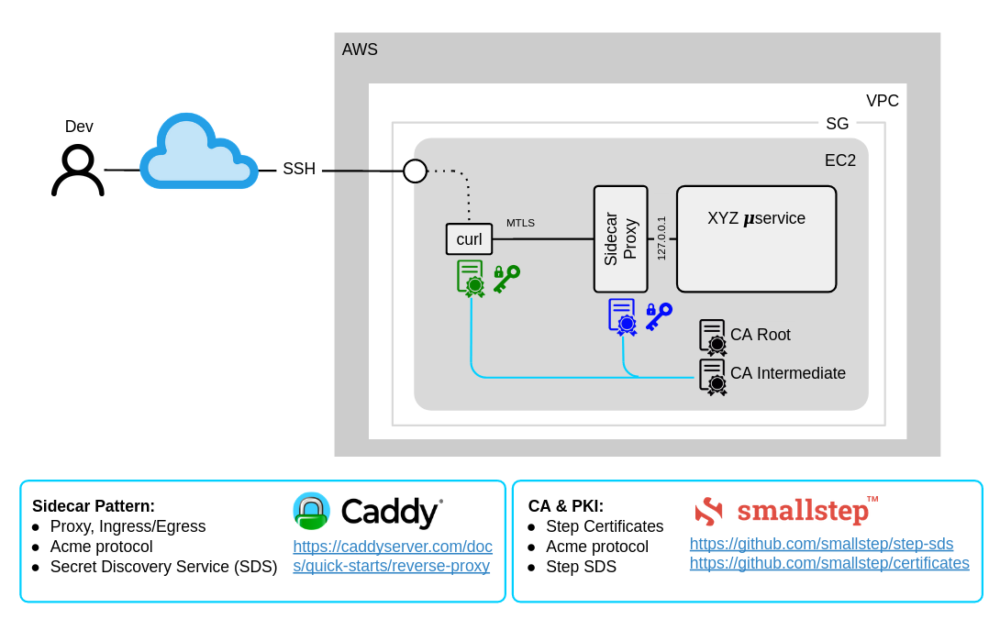
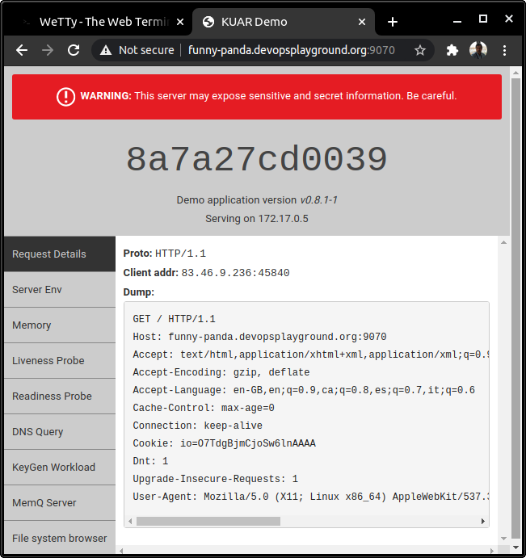
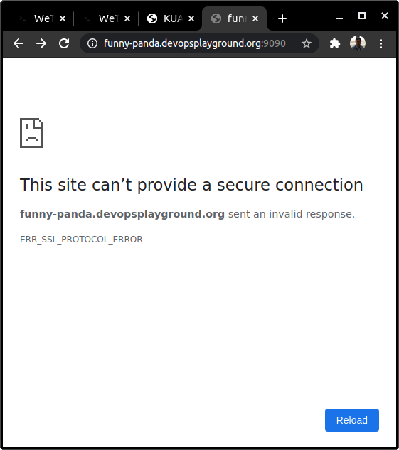
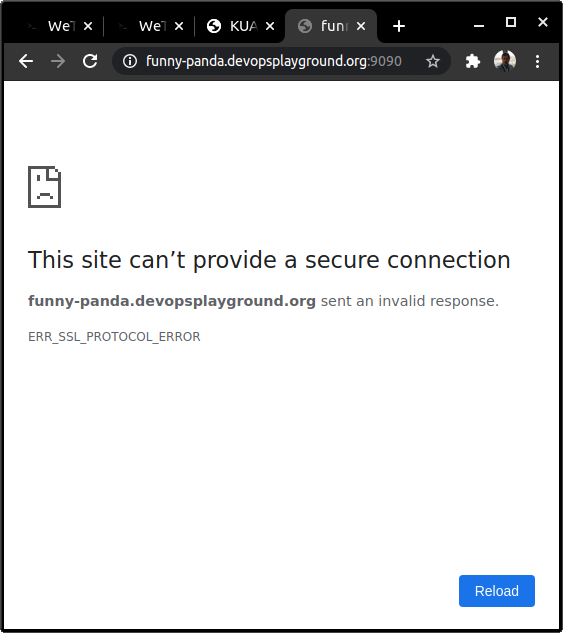
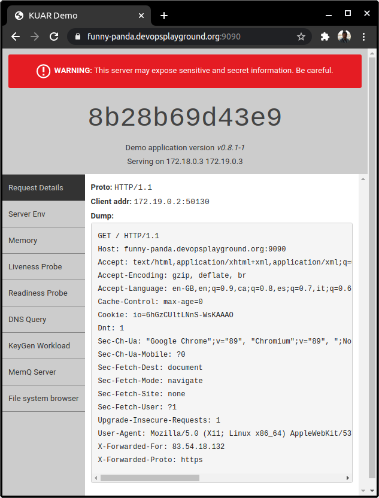
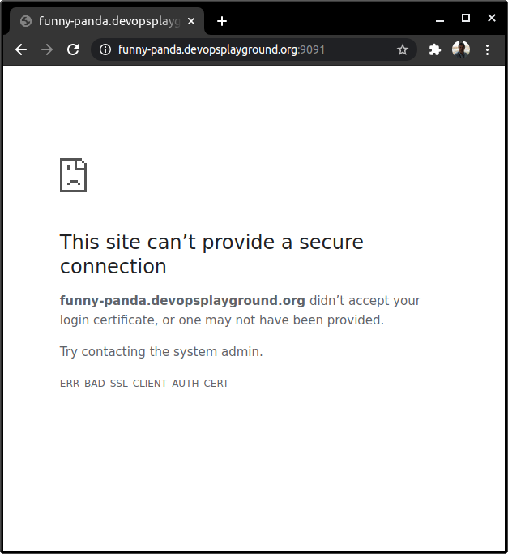
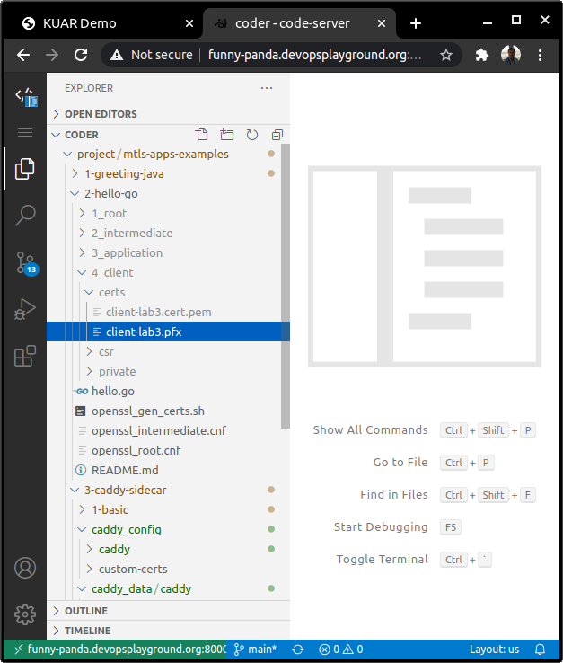
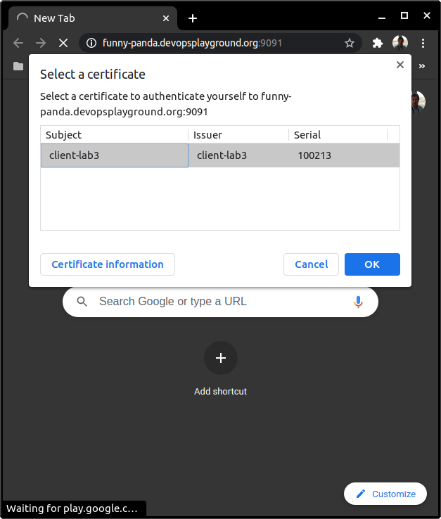

# Example 3. Using Caddy as Sidecar/Proxy for Microservices

Caddy as sidecar proxy for any kind of microservices to manage MTLS and Certificates




## Tools used

* [Caddy v2 ](https://caddyserver.com/v2)
* [SmallStep Certificates (libraries already embeded in Caddy v2)](https://github.com/smallstep/certificates)
* Docker


## Preparation

First of all, open 3 Browser tabs, in 2 of them open a [Wetty Terminal](https://github.com/chilcano/mtls-apps-examples/) and in both go to the working directory for this example. 

```sh
cd $HOME/workdir/mtls-apps-examples/3-caddy-sidecar
```

In the 3rd Browser tab open the [Code-Server](https://github.com/chilcano/mtls-apps-examples/).

Also make sure the owner of all files and directories under `workdir` is `$USER`, if the owner is `root` the labs will not work.  
You can set up a owner using this command: `sudo chown -R $USER $HOME/workdir/`


> **Recommendation:**   
> You can use the [Code-Server](https://github.com/chilcano/mtls-apps-examples/) that you opened in the 3rd Browser tab to edit files.


#### Caddy and Docker

Caddy can be installed as a Linux service, the [binary can be downloaded](https://caddyserver.com/download) and embedded in applications or use it in a [Docker Container](https://hub.docker.com/_/caddy). This latest option is the way we are going to use along this Lab.


**Once installed Docker we are ready to download Caddy Docker image.**
```sh
docker pull caddy
```

**Checking the downloaded Caddy docker image.**
```sh
docker images
```

**Exploring Caddy docker process.**  
```sh
docker exec -it caddy2 ls -la /config/caddy/

docker exec -it caddy2 ls -la /data/caddy/

docker exec -it caddy2 ls -la /usr/share/caddy/
```

* `/config/caddy/` - It is the directory where the Caddy configuration is saved.
* `/data/caddy/` - It is the directory where the Caddy data (certificates, CA, etc.) is saved.
* `/usr/share/caddy/` - It is the directory where the static web page is saved.

All above directories can be mounted.  

**Caddy logs.**   
Caddy can [generate formated logs](https://caddyserver.com/docs/caddyfile/directives/log), but in this lab the Docker' stdout is enough:
```sh
docker logs -f caddy2
```
  
Or tail the log file is stored in the Docker engine directory.
```sh
CONTAINER_ID=$(docker inspect --format="{{.Id}}" caddy2)
sudo tail -f  /var/lib/docker/containers/${CONTAINER_ID}/${CONTAINER_ID}-json.log | jq '.'
```

**Checking the running Caddy docker instances.**
```sh
docker ps
```

**Remove recently created container instances.**
```sh
docker rm -f caddy1 caddy2
```

## Steps

### I. Caddy as HTTP Proxy or Sidecar Proxy.

We are going to configure Caddy as a Proxy (no as `file_server`) listening on `9080` to expose Kuard ([Demo application for "Kubernetes Up and Running"](https://github.com/kubernetes-up-and-running/kuard)) running `9070` port.

#### 1. Running Kuard as Webapp

```sh
docker run -d -p 9070:8080 \
    --name kuard \
    gcr.io/kuar-demo/kuard-amd64:1
```

Now, check if Kuard is running:
```sh
curl http://localhost:9070/healthy
```

And from your browser, you need to use your assigned FQDN (`http://<your-panda>.devopsplayground.org`) in your browser, you should see this:




#### 2. Update Caddyfile to run Caddy as reverse proxy

```sh
cat 1-basic/Caddyfile.example2
```

```sh
localhost:9080

reverse_proxy localhost:9070
```

#### 3. Running Caddy as Proxy

Create these directories.
```sh
mkdir caddy_data caddy_config
```

```sh
docker run -d -p 9090:9080 \
    -v $PWD/1-basic/Caddyfile.example2:/etc/caddy/Caddyfile \
    -v $PWD/caddy_data:/data \
    -v $PWD/caddy_config:/config \
    --name caddy3 \
    caddy
```

Checking all Docker processes:
```sh
docker ps -a
```

#### 4. Calling Kuard through Proxy.

 From your 2nd Wetty terminal execute this:
```sh
curl -ik https://localhost:9090/healthy

HTTP/2 502 
server: Caddy
content-length: 0
date: Sun, 07 Mar 2021 16:45:15 GMT
```

From your local computer using a browser:  



Open other Wetty terminal in your remote workstation and tail the caddy logs to check what is happening:

```sh
CONTAINER_ID=$(docker inspect --format="{{.Id}}" caddy3)
sudo tail -f  /var/lib/docker/containers/${CONTAINER_ID}/${CONTAINER_ID}-json.log | jq
```

You should see below events:
```sh
[...]
{
  "log": "{\"level\":\"error\",\"ts\":1615135306.509363,\"logger\":\"http.log.error\",\"msg\":\"dial tcp 127.0.0.1:9070: connect: connection refused\",\"request\":{\"remote_addr\":\"172.17.0.1:51436\",\"proto\":\"HTTP/2.0\",\"method\":\"GET\",\"host\":\"localhost:9090\",\"uri\":\"/healthy\",\"headers\":{\"User-Agent\":[\"curl/7.58.0\"],\"Accept\":[\"*/*\"]},\"tls\":{\"resumed\":false,\"version\":772,\"cipher_suite\":4865,\"proto\":\"h2\",\"proto_mutual\":true,\"server_name\":\"localhost\"}},\"duration\":0.000472143,\"status\":502,\"err_id\":\"x41mreg93\",\"err_trace\":\"reverseproxy.statusError (reverseproxy.go:783)\"}\n",
  "stream": "stderr",
  "time": "2021-03-07T16:41:46.509521725Z"
}
```

__What is the problem?__   
* We are having `reverseproxy.statusError`, that means the Caddy container is working as proxy but it can not route the traffic to the Kuard container.
* The Caddy container is trying to route the traffic from `localhost:9080` to `reverse_proxy localhost:9070`.
* This error makes sense because Caddy and Kuard are running in the Docker Network, and hostnames like `127.0.0.1` and `localhost` are not the right IP addresses or Hostnames that docker instances have. This is the normal behaviour of running services in Docker containers, they sre running in an isolated manner. Then, to establish communication between 2 containers, we will need to do it through the Docker Network.


#### 5. Creating a Docker Network and add both containers.

We are going to create the `lab3-net` Docker Network and add `caddy3` and `kuard` containers.
```sh
docker network create lab3-net

docker network connect lab3-net caddy3

docker network connect lab3-net kuard
```

Checking the `lab3-net` Docker Network. You should see the Subnet addresses, the Gateway, the Network type and intarnal containers' IP addresses and assigned hostnames.
```sh
docker network inspect lab3-net | jq
```

And finally, you will be able to reach using internal IP address or hostname (it is the value assigned to `--name` when the container was created) to any container associated to `lab3-net` network. We can check it using `ping`:
```sh
docker exec -it caddy3 ping kuard
``` 

If you get the next information, then that means that `caddy3` and `kuard` containers are part of same Docker network and we can call our service through the proxy.
```sh 
PING kuard (172.19.0.3): 56 data bytes
64 bytes from 172.19.0.3: seq=0 ttl=64 time=0.108 ms
64 bytes from 172.19.0.3: seq=1 ttl=64 time=0.095 ms
64 bytes from 172.19.0.3: seq=2 ttl=64 time=0.093 ms
``` 


#### 6. Trying to call Kuard through Proxy.

After creating a Docker network, we will need to do make a slight change to `1-basic/Caddyfile.example2`.
```sh
{
    debug
}
localhost:9080

## kuard is the docker name
## 8080 is the standard port that kuard use (it isn't a docker port)
reverse_proxy kuard:8080
```

With these changes, redeploy the `caddy3` container. Before, we have to remove it:

```sh
docker rm -f caddy3
```

Now, run an updated Caddy instance:
```sh
docker run -d -p 9090:9080 \
    -v $PWD/1-basic/Caddyfile.example2:/etc/caddy/Caddyfile \
    -v $PWD/caddy_data:/data \
    -v $PWD/caddy_config:/config \
    --name caddy3 \
    --net lab3-net \
    caddy
```

You will note the above command will create `caddy3` container and will add it into the `lab3-net` docker network.  

Check the `caddy3` docker logs:   
```sh
CONTAINER_ID=$(docker inspect --format="{{.Id}}" caddy3)
```

```sh
sudo tail -fn 1000  /var/lib/docker/containers/${CONTAINER_ID}/${CONTAINER_ID}-json.log | jq 
```

In the logs you will see that Caddy has generated a TLS certificate (and key-pair) for `caddy3` running on `localhost`, then we are ready to call the service over HTTPS.   

Let's call to `kuard` container over HTTPS through Caddy Proxy but bypassing the validation of server certificate.   
```sh
curl -ivk https://localhost:9090/healthy
```

You should see in the HTTP headers the TLS handshake.


#### 7. Call Kuard through Proxy from a browser.

You will see the same error message you got when both containers are not part of the same Docker network.   


And if you check the `caddy3` docker logs, you will see the error:   
```sh
sudo tail -fn 1000  /var/lib/docker/containers/${CONTAINER_ID}/${CONTAINER_ID}-json.log | jq 
```

```sh
{
  "log": "{\"level\":\"debug\",\"ts\":1615155607.5234804,\"logger\":\"http.stdlib\",\"msg\":\"http: TLS handshake error from 83.54.18.132:34204: no certificate available for 'funny-panda.devopsplayground.org'\"}\n",
  "stream": "stderr",
  "time": "2021-03-07T22:20:07.523665941Z"
}
```
It means the Chrome can not load the page because the certificate that Caddy generated doesn't match the FQDN used to call the `kuard` service.
Caddy embeds an [internal PKI only to generate internal certificates](https://github.com/smallstep/certificates) (i.e. certificate for `localhost`) and it can not establish TLS connection because that certificate was issued to `localhost`, not to your assigned FQDN (`<your-panda>.devopsplayground.org`).  
   
Then, let's update `caddy3` and get a proper certificate for your assigned FQDN. 


### II. Enabling One-way TLS.

#### 1. Update Caddyfile to use the FQDN.

Add a slight change to `1-basic/Caddyfile.example2`. Make sure you get the right FQDN, if not, it will fail. In my case, mine is `funny-panda.devopsplayground.org`.

```sh
{
    debug
}
## replace localhost for the fqdn
funny-panda.devopsplayground.org:9080

reverse_proxy kuard:8080
```

#### 2. Redeploy Caddy.

Once updated, redeploy the `caddy3` container.
```sh
docker rm -f caddy3

docker run -d -p 9090:9080 \
    -v $PWD/1-basic/Caddyfile.example2:/etc/caddy/Caddyfile \
    -v $PWD/caddy_data:/data \
    -v $PWD/caddy_config:/config \
    --name caddy3 \
    --net lab3-net \
    caddy
```

#### 3. Check the Caddy logs.

```sh
CONTAINER_ID=$(docker inspect --format="{{.Id}}" caddy3)
```

```sh
sudo tail -fn 1000  /var/lib/docker/containers/${CONTAINER_ID}/${CONTAINER_ID}-json.log | jq 
```

You should see this:
```sh
[...]
{
  "log": "{\"level\":\"info\",\"ts\":1615159892.8294432,\"logger\":\"tls.obtain\",\"msg\":\"certificate obtained successfully\",\"identifier\":\"funny-panda.devopsplayground.org\"}\n",
  "stream": "stderr",
  "time": "2021-03-07T23:31:32.829497212Z"
}
{
  "log": "{\"level\":\"info\",\"ts\":1615159892.829536,\"logger\":\"tls.obtain\",\"msg\":\"releasing lock\",\"identifier\":\"funny-panda.devopsplayground.org\"}\n",
  "stream": "stderr",
  "time": "2021-03-07T23:31:32.829565267Z"
}
{
  "log": "{\"level\":\"debug\",\"ts\":1615159892.8301756,\"logger\":\"tls\",\"msg\":\"loading managed certificate\",\"domain\":\"funny-panda.devopsplayground.org\",\"expiration\":1622932292,\"issuer_key\":\"acme-v02.api.letsencrypt.org-directory\",\"storage\":\"FileStorage:/data/caddy\"}\n",
  "stream": "stderr",
  "time": "2021-03-07T23:31:32.830220434Z"
}
```

#### 4. Call the service through the Caddy proxy.

Call the service from Wetty using curl:   
```sh
curl https://funny-panda.devopsplayground.org:9090/healthy

ok
```

And finally, call the service from Chrome using the FQDN:   



You will see the `caddy3` is running with the IP `172.19.0.2` and `kuard` with the IP `172.19.0.3`. You can check it with this command:

```sh
docker network ls

NETWORK ID     NAME             DRIVER    SCOPE
a6d11919ae92   bridge           bridge    local
ca5966db93ae   host             host      local
d4dc72571f42   lab3-net         bridge    local
b564bb82a281   none             null      local
b52f92249fab   playground-net   bridge    local
```

```sh
docker network inspect lab3-net | jq
```

```sh
[
  {
    "Name": "lab3-net",
    "Id": "d4dc72571f42b9352fbf9161026071613e55b171e8f267341fc5966f8758ab78",
    "Created": "2021-03-07T18:53:25.85471742Z",
    "Scope": "local",
    "Driver": "bridge",
    "EnableIPv6": false,
    "IPAM": {
      "Driver": "default",
      "Options": {},
      "Config": [
        {
          "Subnet": "172.19.0.0/16",
          "Gateway": "172.19.0.1"
        }
      ]
    },
    "Internal": false,
    "Attachable": false,
    "Ingress": false,
    "ConfigFrom": {
      "Network": ""
    },
    "ConfigOnly": false,
    "Containers": {
      "8b28b69d43e9de7601a1dc54329bc483e7d83bedbc7daf61205829a328563143": {
        "Name": "kuard",
        "EndpointID": "8e8cc31f37978bf26e099aa1eeabf2ad830e2e50e7d7b26272adbdd7bb839f97",
        "MacAddress": "02:42:ac:13:00:03",
        "IPv4Address": "172.19.0.3/16",
        "IPv6Address": ""
      },
      "da9ebfad457e735443db184df79b577f94109d12fa764232fede2a17f6d1c981": {
        "Name": "caddy3",
        "EndpointID": "378c937c6064b48c72bd7de4a67cab95482aee696f025d2a7beb19ad8945c24d",
        "MacAddress": "02:42:ac:13:00:02",
        "IPv4Address": "172.19.0.2/16",
        "IPv6Address": ""
      }
    },
    "Options": {},
    "Labels": {}
  }
]
```


### III. Enabling Two-way TLS (Mutual TLS authentication).

MTLS requires:
- a client certificate (and key-pair) and be installed in the Client (Chrome or any browser) certificate store
- enable the Caddy TLS policy to require present a valid client certificate during the TLS handshake
- set the certificate chain (CA Root and Intermediate that issued the client certificate) in caddy to allow (Client Authentication) the client to establish secure communication.


#### 1. Generate a client certificate.

We are going to use the already generated client certificate and its corresponding certificate chain (root and intermediate) from previous exercise.
```sh
cd ../2-hello-go/

./openssl_gen_certs.sh cleanup

./openssl_gen_certs.sh client-lab3 secret

openssl pkcs12 -export \
    -out 4_client/certs/client-lab3.pfx \
    -inkey 4_client/private/client-lab3.key.pem \
    -in 4_client/certs/client-lab3.cert.pem \
    -passin pass:secret \
    -passout pass:secret

mkdir -p ../3-caddy-sidecar/caddy_config/custom-certs/

cp 2_intermediate/certs/ca-chain.cert.pem ../3-caddy-sidecar/caddy_config/custom-certs/.

cp 2_intermediate/certs/intermediate.cert.pem ../3-caddy-sidecar/caddy_config/custom-certs/.
```


#### 2. Update Caddyfile

Now, let's update the Caddyfile with the right TLS policy. 

```sh
cd ../3-caddy-sidecar/

nano 1-basic/Caddyfile.mtls
```

> **Important:**   
> Change `<YOUR-PANDA>` with your assigned FQDN.  

```sh
{
    debug
}
(mTLS) {
    tls {
        client_auth {
            mode require_and_verify
            trusted_ca_cert_file /config/custom-certs/ca-chain.cert.pem
        }
    }
}

<YOUR-PANDA>.devopsplayground.org:9081 {
    reverse_proxy kuard:8080
    import mTLS
}
```


#### 3. Create a new Caddy docker instance

```sh
docker rm -f caddy4

docker run -d -p 9091:9081 \
    -v $PWD/1-basic/Caddyfile.mtls:/etc/caddy/Caddyfile \
    -v $PWD/caddy_data:/data \
    -v $PWD/caddy_config:/config \
    --name caddy4 \
    --net lab3-net \
    caddy
```


#### 4. Call the service and check MTLS


From Wetty using curl:
```sh
FQDN="funny-panda.devopsplayground.org"

curl --cacert caddy_data/caddy/certificates/acme-v02.api.letsencrypt.org-directory/${FQDN}/${FQDN}.crt \
       --cert ../2-hello-go/4_client/certs/client-lab3.cert.pem:secret \
       --key ../2-hello-go/4_client/private/client-lab3.key.pem \
       https://${FQDN}:9091/healthy

```


If you call Kuard through Caddy Proxy using a Browser you will get the next error. That is because your browser doesn't have the client certificate (and encrypted private key) and its corresponding certificate chain.




Checking errors:   
```sh
CONTAINER_ID4=$(docker inspect --format="{{.Id}}" caddy4)

sudo tail -fn 1000  /var/lib/docker/containers/${CONTAINER_ID4}/${CONTAINER_ID4}-json.log | jq 
```

```sh
[...]
{
  "log": "{\"level\":\"info\",\"ts\":1615165875.9552908,\"msg\":\"serving initial configuration\"}\n",
  "stream": "stderr",
  "time": "2021-03-08T01:11:15.95544693Z"
}
{
  "log": "{\"level\":\"debug\",\"ts\":1615166146.184904,\"logger\":\"http.stdlib\",\"msg\":\"http: TLS handshake error from 35.179.96.88:46116: EOF\"}\n",
  "stream": "stderr",
  "time": "2021-03-08T01:15:46.185113207Z"
}
{
  "log": "{\"level\":\"debug\",\"ts\":1615166244.1928227,\"logger\":\"http.stdlib\",\"msg\":\"http: TLS handshake error from 83.54.18.132:39742: EOF\"}\n",
  "stream": "stderr",
  "time": "2021-03-08T01:17:24.192993722Z"
}
{
  "log": "{\"level\":\"debug\",\"ts\":1615166244.2752433,\"logger\":\"http.stdlib\",\"msg\":\"http: TLS handshake error from 83.54.18.132:39744: tls: client didn't provide a certificate\"}\n",
  "stream": "stderr",
  "time": "2021-03-08T01:17:24.275433878Z"
}
```

Then, to avoid above errors let's install the client certificate in Browser's certificate store. 




Once certificate installed, open from your Browser the Kuard URL. Immediately after the server (Caddy), will ask you to select the client certificate to establish a secure communication:




And finally, you should see in the `caddy4` logs the request, response and all activity over Kuard.


## References

* JSON schema generator for Caddy v2:
   - https://github.com/abiosoft/caddy-json-schema

* Caddy reverse_proxy directive:
   - https://caddyserver.com/docs/caddyfile/directives/reverse_proxy
* Using Caddy in Docker to reverse proxy to localhost apps:
   - https://caddy.community/t/using-caddy-in-docker-to-reverse-proxy-to-localhost-apps/9493
* Caddy Docker Proxy plugin:
   - https://github.com/lucaslorentz/caddy-docker-proxy