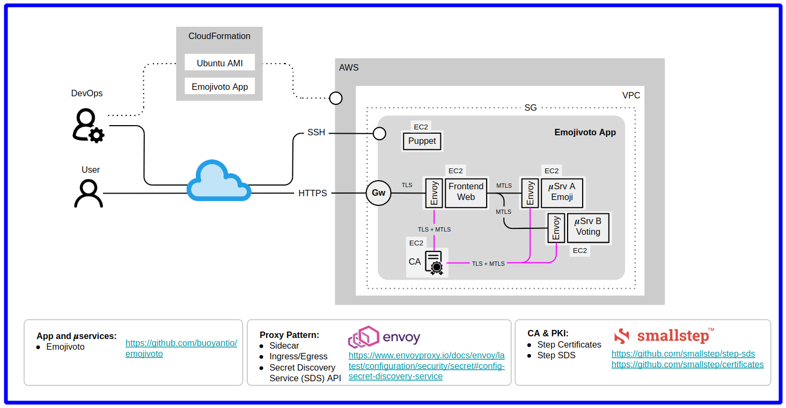

# MTLS Emojivoto on AWS

> This Git repo is based in [SmallStep Emojivoto demo](https://github.com/smallstep/step-aws-emojivoto).  
> The application used is the [Buoyant Emojivoto](https://github.com/buoyantio/emojivoto) microservices.  

Technology used:

* AWS to host the example application.
* Puppet for machine-level provisioning.
* Terraform to configure the infrastructure.
* [Envoy Proxy](https://www.envoyproxy.io) as sidecar, [handle TLS and manage the TLS secrets](https://www.envoyproxy.io/docs/envoy/latest/configuration/security/secret#config-secret-discovery-service).
* [SmallStep Certificates](https://github.com/smallstep/certificates) & [SmallStep SDS](https://github.com/smallstep/step-sds) for certificate management.

## Microservices Deployment Architecture

This example will use automation to provision an instance of [Emojivoto](https://github.com/buoyantio/emojivoto) and enable MTLS authentication for the microservices.



* Emojivoto as is does not support (m)TLS.
* Every service in the diagram above will run on its own dedicated VM (EC2 instance) in AWS.
* An Envoy Proxy as sidecar (ingress & egress) per service will handle mutual TLS (authentication & encryption).
* Envoy sidecars obtain certificates through the [Secret Discovery Service (SDS)](https://www.envoyproxy.io/docs/envoy/latest/configuration/security/secret#config-secret-discovery-service) from exposed SmallStep SDS (via a local UNIX domain socket).
* [SmallStep SDS](https://github.com/smallstep/step-sds) will fetch a certificate, as well as the trust bundle (root certificate), from the internal CA ([SmallStep Certificates](https://github.com/smallstep/certificates)) on behalf of each service/sidecar pair.
* [SmallStep SDS](https://github.com/smallstep/step-sds) will handle renewals for certificates that are nearing the end of their lifetimes.

## Instructions

### Step 1. AWS configuration


```bash
# you can overwtite it exporting AWS_ACCESS_KEY_ID, AWS_SECRET_ACCESS_KEY and AWS_DEFAULT_REGION 
$ aws configure

AWS Access Key ID []: ****************UJ7U
AWS Secret Access Key []: ****************rUg8
Default region name []: eu-west-2
Default output format []: json

# should list S3 buckets if the account has any
$ aws s3 ls

2017-10-26 13:50:39 smallstep-not-a-real-bucket
2017-10-26 15:43:20 smallstep-fake-bucket
2018-04-09 17:25:18 smallstep-nobody-home
```

### Step 2. SSH Keys

Terraform requires a SSH key pair (public key - PEM format) to be used for provisioning EC2 instances. While that Puppet provisioning process will require another SSH key pair (private key).
I've modified existing Terraform scripts to use a same SSH key pair (public and private keys) to provisioning EC2 instances and to provisioning through Puppet.

```bash
$ ssh-keygen -P "" -m PEM -f ~/.ssh/<your-key-name>
```

### Step 3. Execute Terraform

The original Terraform scripts used a backend hosted by [Hashicorp](https://app.terraform.io/session) to store state information about managed infrastrucutre, however I've tweaked those in order to use the local system to persist the Terraformk state.  
Once AWS CLI and Terraform CLI & definitions are in place, we can initialize the workspace on the local terraform backend:


```bash
# clone the Git repo
$ git clone https://github.com/chilcano/mtls-emojivoto-tf
$ cd mtls-emojivoto-tf

# initialize 
$ terraform init

$ terraform plan

# deploy
$ terraform apply 
  -var key_name="<your-key-name>" \
  -var puppet_ssh_privkey_filename="<your-key-name>" \
  -var instance_type="t2.medium" \
  -var region="eu-west-2"
```

After some wait time Terraform will confirm the successful completion, printing out details about the newly created infrastructure:

```bash
[...]
aws_instance.web (remote-exec): Info: Creating state file /var/cache/puppet/state/state.yaml
aws_instance.web (remote-exec): Notice: Applied catalog in 39.59 seconds
aws_instance.web (remote-exec): + sudo puppet agent --server puppet.emojivoto.local
aws_instance.web: Creation complete after 2m6s [id=i-0481e26a14f8f74b8]
aws_route53_record.web: Creating...
aws_route53_record.web: Still creating... [10s elapsed]
aws_route53_record.web: Still creating... [20s elapsed]
aws_route53_record.web: Still creating... [30s elapsed]
aws_route53_record.web: Still creating... [40s elapsed]
aws_route53_record.web: Creation complete after 47s [id=ZIAUV5309R860_web.emojivoto.local_A]

Apply complete! Resources: 21 added, 0 changed, 0 destroyed.

Outputs:

ca_ip = 13.57.209.0
emoji_ip = 54.183.41.170
puppet_ip = 54.183.255.218
voting_ip = 54.153.37.230
web_ip = 18.132.246.79
```

## Explore MTLS Emojivoto on AWS

AWS Emojivoto is using internal DNS records to resolve hosts for inter-service communication. All TLS certificates are issued for (SANs) the respective DNS name, e.g. `web.emojivoto.local` or `voting.emojivoto.local` (please see [dns.tf](dns.tf) for details).

For this to work on machines without managed external DNS the hostname/IP address mapping needs to be added to `/etc/hosts` in your local computer (from where the Terraform scripts were run) so that hostnames can be verified against server certificates.

```bash
$ cat /etc/hosts

127.0.0.1       localhost
127.0.1.1       inti-snd

# The following lines are desirable for IPv6 capable hosts
::1     ip6-localhost ip6-loopback
fe00::0 ip6-localnet
ff00::0 ip6-mcastprefix
ff02::1 ip6-allnodes
ff02::2 ip6-allrouters

######## MTLS Emojivoto 
18.132.246.79   web.emojivoto.local
```

AWS Emojivoto leverages an internal CA to secure communication between services so every client must specify the root certificate (`root_ca.crt`) of the internal CA to trust it explicitly.

### 1. Using Step CLI

**Install SmallStep Step CLI for Linux (amd64.deb)**  

```sh
$ curl -s https://raw.githubusercontent.com/chilcano/mtls-emojivoto-tf/main/_assets/bash/get_step_cli.sh | bash
``` 

**Get `root_ca.crt`**

```sh
$ ssh ubuntu@<emojivoto-ca-ip> -i ~/.ssh/<ssh-pub-key>

$ step ca root root_ca.crt --ca-url https://localhost:443
'step ca root' requires the '--fingerprint' flag

$ cat /usr/local/lib/step/config/ca.json
$ ll /usr/local/lib/step/certs/
total 16
drwxr-xr-x 2 step puppet 4096 Feb 14 17:07 ./
drwxr-xr-x 6 step puppet 4096 Feb 14 17:07 ../
-rw-r--r-- 1 step puppet  648 Feb 14 17:07 intermediate_ca.crt
-rw-r--r-- 1 step puppet  587 Feb 14 17:07 root_ca.crt
```

**Query `https://web.emojivoto.local`**

```sh
$ step certificate inspect --roots root_ca.crt --short https://web.emojivoto.local

X.509v3 TLS Certificate (ECDSA P-256) [Serial: 1993...2666]
  Subject:     web.emojivoto.local
  Issuer:      Smallstep Test Intermediate CA
  Provisioner: step-sds [ID: Z2S-...gK6U]
  Valid from:  2019-07-25T21:13:35Z
          to:  2019-07-26T21:13:35Z
```

### 2. Using cURL

```bash
$ curl -I --cacert root_ca.crt https://web.emojivoto.local

HTTP/1.1 200 OK
content-type: text/html
date: Fri, 12 Feb 2021 20:27:02 GMT
content-length: 560
x-envoy-upstream-service-time: 0
server: envoy

# without --cacert specifying the root cert it will fail (expected)
$ curl -I root_ca.crt https://web.emojivoto.local

curl: (6) Could not resolve host: root_ca.crt
curl: (60) SSL certificate problem: unable to get local issuer certificate
More details here: https://curl.haxx.se/docs/sslcerts.html

curl performs SSL certificate verification by default, using a "bundle"
 of Certificate Authority (CA) public keys (CA certs). If the default
 bundle file isn't adequate, you can specify an alternate file
 using the --cacert option.
[...]
```

### 3. Using a browser

Navigating a browser to [`https://web.emojivoto.local/`](https://web.emojivoto.local/) will result in a big alert warning that **`Your connection is not private`**. The reason for the alert is `NET::ERR_CERT_AUTHORITY_INVALID` which a TLS error code. The error code means that the certificate path validation could not be verified against the locally known root certificates in the trust store. 
Since the TLS cert for AWS Emojivoto's web service is **not** using `Public Web PKI` this is expected. Beware of these warnings. In this particular case where we're using an internal CA it's safe to `Proceed to web.emojivoto.local` under the `Advanced` menu.

It is possible to avoid the TLS warning by installing the internal CA's root certificate into your local trust store. The step CLI has a command to do exactly that:

```bash
# Navigate browser to https://web.emojivoto.local without warning
$ sudo step certificate install root_ca.crt

Certificate root_ca.crt has been installed.
X.509v3 Root CA Certificate (ECDSA P-256) [Serial: 1038...4951]
  Subject:     Smallstep Test Root CA
  Issuer:      Smallstep Test Root CA
  Valid from:  2021-02-12T22:14:14Z
          to:  2031-02-09T22:14:14Z

# Remove root cert from local trust store. Warning will reappear
$ sudo step certificate uninstall root_ca.crt

Certificate root_ca.crt has been removed.
X.509v3 Root CA Certificate (ECDSA P-256) [Serial: 1038...4951]
  Subject:     Smallstep Test Root CA
  Issuer:      Smallstep Test Root CA
  Valid from:  2021-02-12T22:14:14Z
          to:  2031-02-09T22:14:14Z
```

## That's it!

Thank you.
