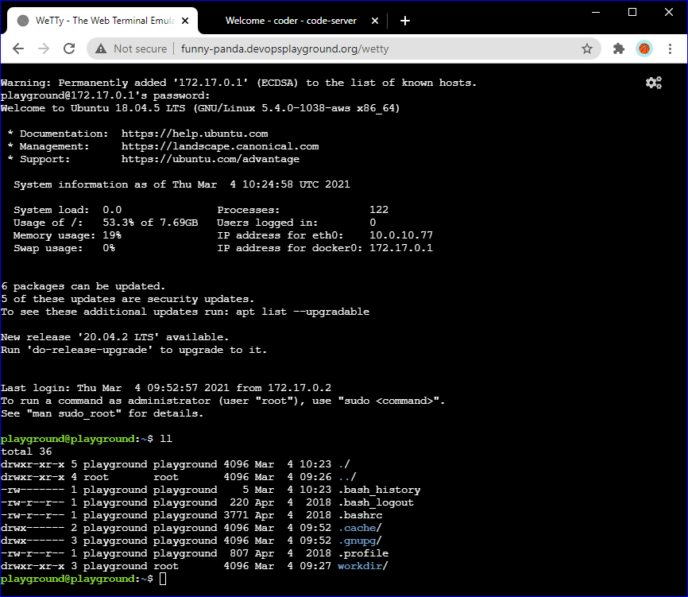
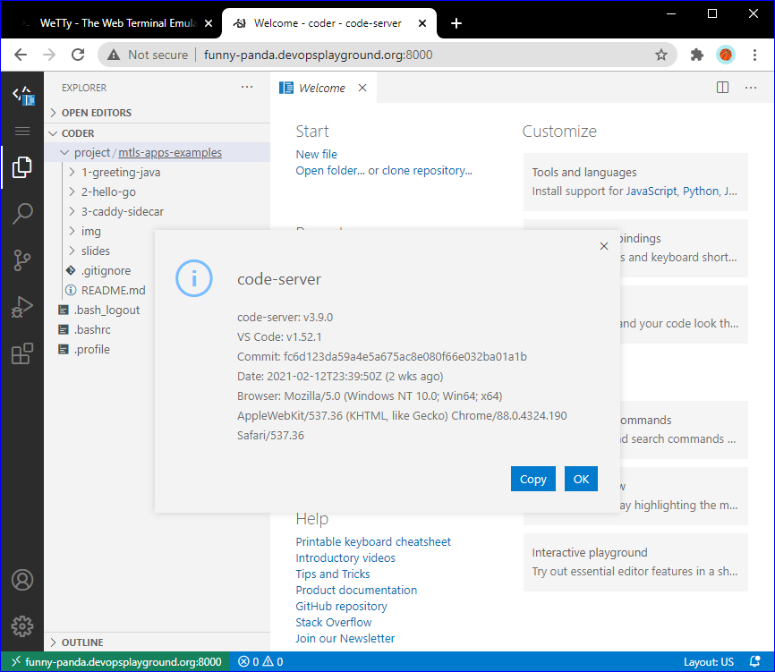

# DevOpsPlayground - Hands-on with MTLS Authentication for Microservices

This repository contains Microservices-based applications used to explain the implementation of Mutual TLS Authentication.


## Slides

[DevOps Playground - MTLS Authn for Microservices](slides/DevOpsPlayground-MTLSAuthnforMicroservices.pdf)


## Labs

| Application                                   | Description
| ---                                           | ---         
| [1-greeting-java](1-greeting-java/)           | Simple REST microservice (Maven Project) based on Spring Boot 2.4.2 and Java 11. 
| [2-hello-go](2-hello-go/)                     | Simple Go microservice used to demonstrate how to implement mutual TLS authentication.
| [3-caddy-sidecar](3-caddy-sidecar/)           | Caddy as sidecar proxy for any kind of microservices to manage MTLS and Certificates.
|                                               |   


## First things first: Get your remote workstation

If you have registed to this workshop through [DevOps Playground Meetup](https://www.meetup.com/DevOpsPlayground/), you likely are able to get a remote workstation provided by **DevOps Playground Team**. The only thing you need to know is what is your assigned `Panda Type`, with that you will have a place where you can follow the workshop.  
If you have `<Panda-Type>` assigned to registration, then you should have access to:

1. Wetty - Web terminal.
   - `http://<Panda-Type>.devopsplayground.org/wetty`
2. Code-Server - Web IDE based on VS Code.
   - `http://<Panda-Type>.devopsplayground.org:8000/`






## Second: Preparation

### Tweak your Linux Prompt

If you don't like to work with vanilla prompt, you can install FancyGit and get a fancy prompt, only run the command below in your Wetty.

```sh
curl -sS https://raw.githubusercontent.com/diogocavilha/fancy-git/master/install.sh | sh
. ~/.bashrc
fancygit human
. ~/.bashrc
```

### Install extra tools

You **probably don't need it**, if so, run the below script and you will get installed Java 11, Maven and Go.

```sh
source <(curl -s https://raw.githubusercontent.com/chilcano/how-tos/master/src/devops_playground_tools_install.sh) 
```
